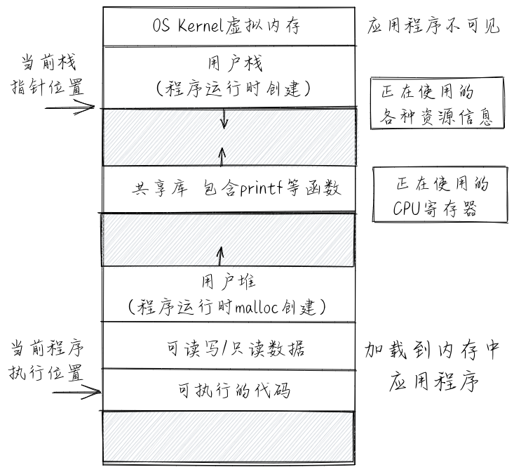

# 操作系统概述

### 概述

- 主要工作：一是向下管理并控制计算机硬件和各种外设，二是向上管理应用软件并提供各种服务

- 操作系统是一个可以管理CPU、内存和各种外设，并管理和服务应用软件的系统软件

**执行环境**

应用程序运行在由硬件、操作系统内核、运行时库、图形界面支持库等所包起来的一个 执行环境 (Execution Environment) 中，应用程序只需根据与系统软件约定好的应用程序二进制接口 (ABI, Application Binary Interface) 来请求执行环境提供的各种服务或功能，从而完成应用程序自己的功能

### 操作系统的系统调用接口

#### API与ABI

操作系统内核是一个需要提供各种服务的软件，其服务对象是应用程序，而用户（这里可以理解为一般使用计算机的人）是通过应用程序的服务间接获得操作系统的服务的，因此操作系统内核藏在一般用户看不到的地方。

但应用程序需要访问操作系统获得操作系统的服务，这就需要通过操作系统的接口才能完成。操作系统的接口形式就是应用程序二进制接口 (ABI, Application Binary Interface)

操作系统不能只提供面向单一编程语言的函数库的编程接口 (API, Application Programming Interface) ，它的接口需要考虑对基于各种编程语言的应用支持，以及访问安全等因素，使得应用软件不能像访问函数库一样的直接访问操作系统内部函数，更不能直接读写操作系统内部的地址空间

为此，操作系统设计了一套安全可靠的接口，我们称为系统调用接口 (System Call Interface)。系统调用接口通常面向应用程序提供了API的描述，但在具体实现上，还需要提供ABI的接口描述规范

在现代处理器的安全支持（特权级隔离，内存空间隔离等）下，应用程序就不能直接以函数调用的方式访问操作系统的函数，以及直接读写操作系统的数据变量

不同类型的应用程序可以通过符合操作系统规定的ABI规范的系统调用接口，发出系统调用请求，来获得操作系统的服务，操作系统提供完服务后，返回应用程序继续执行。

> **API 与 ABI 的区别**
>
> 应用程序二进制接口 ABI 是不同二进制代码片段的连接纽带。ABI 定义了二进制机器代码级别的规则，主要包括基本数据类型、通用寄存器的使用、参数的传递规则、以及堆栈的使用等等。ABI 与处理器和内存地址等硬件架构相关，是用来约束链接器 (Linker) 和汇编器 (Assembler) 的。**在同一处理器下，基于不同高级语言编写的应用程序、库和操作系统，如果遵循同样的 ABI 定义，那么它们就能正确链接和执行。**
>
> 应用程序编程接口 API 是不同源代码片段的连接纽带。API 定义了一个源码级（如 C 语言）函数的参数，参数的类型，函数的返回值等。因此 **API 是用来约束编译器 (Compiler) 的**：一个 API 是给编译器的一些指令，它规定了源代码可以做以及不可以做哪些事。**API 与编程语言相关**，如 libc 是基于 C 语言编写的标准库，那么基于 C 的应用程序就可以通过编译器建立与 libc 的联系，并能在运行中正确访问 libc 中的函数。

#### 系统调用接口与功能

一些相对比较重要的操作系统接口或抽象，以及它们的大致功能：

- 进程（即程序运行过程）管理：复制创建进程 fork 、退出进程 exit 、执行进程 exec 等。
- 线程管理：线程（即程序的一个执行流）的创建、执行、调度切换等。
- 线程同步互斥的并发控制：互斥锁 mutex 、信号量 semaphore 、管程 monitor 、条件变量 condition variable 等。
- 进程间通信：管道 pipe 、信号 signal 、事件 event 等。
- 虚存管理：内存空间映射 mmap 、改变数据段地址空间大小 sbrk 、共享内存 shm 等。
- 文件I/O操作：对存储设备中的文件进行读 read 、写 write 、打开 open 、关闭 close 等操作。
- 外设I/O操作：外设包括键盘、显示器、串口、磁盘、时钟 … ，主要采用文件 I/O 操作接口。

> 在某种程度上说明了操作系统对计算机硬件重要组成的抽象和虚拟化，这样会有助于应用程序开发。应用程序员只需访问统一的抽象概念（如文件、进程等），就可以使用各种复杂的计算机物理资源（处理器、内存、外设等）：
>
> - 文件 (File) 是外设的一种抽象和虚拟化。特别对于存储外设而言，文件是持久存储的抽象
> - 地址空间 (Address Space) 是对内存的抽象和虚拟化
> - 进程 (Process) 是对计算机资源的抽象和虚拟化。而其中最核心的部分是对CPU的抽象与虚拟化

### 操作系统抽象

#### 执行环境

执行环境 (Execution Environment) 它主要负责给在其上执行的软件提供相应的功能与资源，并可在计算机系统中形成多层次的执行环境。

- 对于直接运行在裸机硬件 (Bare-Metal) 上的操作系统，其执行环境是 计算机的硬件 

- 随着计算机技术的发展，应用程序下面形成了一层比较通用的函数库，这使得应用程序不需要直接访问硬件了，它所需要的功能（比如显示字符串）和资源（比如一块内存）都可以通过函数库的函数来帮助完成，此时应用程序的执行环境就变成了 函数库 -> 计算机硬件 ，而这时函数库的执行环境就是计算机的硬件

- 再进一步，操作系统取代了函数库来访问硬件，函数库通过访问操作系统的系统调用服务来进一步给应用程序 提供丰富的功能和资源。应用程序的执行环境就变成了 函数库 -> 操作系统内核 -> 计算机硬件

  - 基于 Java 语言的应用程序，在函数库和操作系统之间，多了一层 Java 虚拟机，此时 Java 应用 程序的执行环境就变成了 函数库 -> Java 虚拟机 -> 操作系统内核 -> 计算机硬件 
  - 在云计算时代，在传统操作系统与 计算机硬件之间多了一层 Hypervisor/VMM ，此时应用程序的执行环境变成了 函数库 -> (Java 虚拟机 ->) 操作系统内核 -> Hypervisor/VMM -> 计算机硬件 

  另外，CPU在执行过程中，可以在不同层次的执行环境之间切换，这称为 执行环境切换 。执行环境切换主要是通过特定的 API 或 ABI 来完成的，这样不同执行环境的软件就能实现数据交换与互操作，而且还保证了彼此之间有清晰的隔离

  

- 对于应用程序的执行环境而言，应用程序只能看到执行环境直接提供给它的接口（API 或 ABI），这使得应用程序所能得到的服务取决于执行环境提供给它的访问接口。所以，操作系统可以看成是应用程序执行环境，其形态可以是一个库，也可以是一个虚拟机等，或者它们的某种组合形式

- 一个基本的定义：执行环境是应用程序正确运行所需的服务与管理环境，用来完成应用程序在运行时的数据与资源管理、应用程序的生存期等方面的处理，它定义了应用程序有权访问的其他数据或资源，并决定了应用程序的行为限制范围

**普通控制流**

普通控制流 (CCF，Common Control Flow，简称 控制流) 

- 编译原理角度：程序的控制流 (Flow of Control or Control Flow) 是指以一个程序的指令、语句或基本块为单位的执行序列
- 计算机组成原理角度：处理器的控制流是指处理器中程序计数器的控制转移序列
- 程序员角度：控制流是程序员编写的程序的执行序列，这些序列是程序员预设好的

**异常控制流**

应用程序在执行过程中，如果发出系统调用请求，或出现外设中断、CPU 异常等情况，处理器执行的前一条指令和后一条指令将会位于两个完全不同的位置，即不同的执行环境

- 比如，前一条指令还在应用程序的代码段中，后一条指令就跑到操作系统的代码段中去了，这就是一种控制流的“突变”，即控制流脱离了其所在的执行环境，并产生 **执行环境的切换**

我们把这种“突变”的控制流称为 **异常控制流** (ECF, Exceptional Control Flow) 

应用程序 感知不到 这种异常的控制流情况，这主要是由于操作系统把这种情况 **透明** 地进行了执行环境的切换和对各种异常情况的处理，让应用程序从始至终地 认为 没有这些异常控制流的产生

简单地说， 异常控制流 是处理器在执行过程中的突变，其主要作用是通过硬件和操作系统的协同工作来响应处理器状态中的特殊变化

- 比如，当应用程序正在执行时，产生了时钟外设中断，导致操作系统打断当前应用程序的执行，转而进入 操作系统 执行环境去处理时钟外设中断。处理完毕后，再回到应用程序中被打断的地方继续执行。

> 这里从操作系统的角度来给出的异常控制流的定义
>
> 在《深入理解计算机系统（CSAPP）》中，对异常控制流也给出了相关定义： 系统必须能对系统状态的变化做出反应，这些系统状态不是被内部程序变量捕获，也不一定和程序的执行相关。现代系统通过使控制流发生突变对这些情况做出反应。我们称这种突变为异常控制流( Exceptional Control Flow, ECF)
>
> 这里的异常控制流不涉及C++/Java等编程语言级的exception机制

**控制流上下文（执行环境的状态）**

站在硬件的角度来看普通控制流或异常控制流的具体执行过程，从控制流起始的某条指令执行开始，指令可访问的所有物理资源的内容，包括自带的所有通用寄存器、特权级相关特殊寄存器、以及指令访问的内存等，会随着指令的执行而逐渐发生变化

这里把控制流在执行完某指令时的物理资源内容，即确保下一时刻能继续 正确 执行控制流指令的物理资源内容称为控制流的 **上下文** (Context) ，也可称为控制流所在执行环境的状态

- 这里说的控制流的上下文是指仅会影响控制流正确执行的有限的物理/虚拟资源内容

- 这里需要理解程序中控制流的上下文对程序 正确 执行的影响
  - 如果在某时刻，由于某种有意或无意的原因，控制流的上下文发生了变化（比如某个寄存器的值变了），但并不是由于程序的控制流本身的指令导致的，这就会使得接下来的程序指令执行出现偏差，并最终导致执行过程或执行结果不符合预期，这种情形称为 程序执行错误。操作系统有责任来保护应用程序中控制流的上下文，以让应用程序得以正确执行

> 物理资源：即计算机硬件资源，如CPU的寄存器、可访问的物理内存等
>
> 虚拟资源：即操作系统提供的资源，如文件，网络端口号，网络地址，信号等

- 如果一个控制流属于某个函数/应用程序/操作系统，那么这个控制流的上下文简称为 函数调用/应用程序/操作系统 上下文

- 如果把某 进程 看做是运行的应用程序，那么这个属于某个应用程序的控制流可简称为某进程上下文
- 如果一个控制流是属于操作系统中处理中断/异常/陷入的那段代码，那么这个控制流的上下文简称为中断/异常/陷入的上下文

- 如果出现了处理器在执行过程中的突变（即异常控制流）或转移（如多层函数调用），需要由维持执行环境的软硬件协同起来，保存发生突变或转移前的控制流上下文，即当前执行环境的状态（比如突变或函数调用前一刻的指令寄存器，栈寄存器和其他一些通用寄存器等内容），并在完成突变处理或被调用函数执行完毕后，恢复突变或转移前的控制流上下文。这是由于完成与突变相关的执行会破坏突变前的控制流上下文（比如上述各种寄存器的内容），导致如果不保存之前的控制流上下文，就无法恢复到突变前的正确的执行环境，继续正常的普通控制流的执行

- 对于异常控制流的上下文保存与恢复，主要是通过 CPU 和操作系统（手动编写在栈上保存与恢复寄存器的指令）来协同完成
- 对于函数转移控制流的上下文保存与恢复，主要是通过编译器（自动生成在栈上保存与恢复寄存器的指令）来帮助完成的。

在操作系统中，需要处理三类异常控制流：外设中断 (Device Interrupt) 、陷入 (Trap) 和异常 (Exception，也称Fault Interrupt)。

**异常控制流：中断**

外设 中断 (Interrupt) 由外部设备引起的外部 I/O 事件如时钟中断、控制台中断等。外设中断是异步产生的，与处理器的执行无关。产生中断后，操作系统需要进行中断处理来响应中断请求，这会破坏被打断前应用程序的控制流上下文，所以操作系统要保存与恢复被打断前应用程序的控制流上下文

**异常控制流：异常**

异常 (Exception) 是在处理器执行指令期间检测到不正常的或非法的内部事件（如除零错、地址访问越界）。产生异常后，操作系统需要进行异常处理，这会破坏被打断前应用程序的控制流上下文，所以操作系统要保存与恢复被打断前应用程序的控制流上下文

> 如果是应用程序产生的不可恢复的异常，操作系统有权直接终止该应用程序的执行

**异常控制流：陷入**

陷入 (Trap) 是在程序中使用请求操作系统服务的系统调用而引发的有意事件。产生陷入后，操作系统需要执行系统调用服务来响应系统调用请求，这会破坏陷入前应用程序的控制流上下文，所以操作系统要保存与恢复陷入前应用程序的控制流上下文

> 在不同的书籍中，对于中断 、陷入和异常的定义会有一些差别
>
> - 有的书籍把中断、陷入和异常都统一为一种中断，表示程序的当前控制流被打断了，要去执行不属于这个控制流的另外一个没有程序逻辑先后关系的控制流
>
> - 也有书籍把这三者统一为一种异常，表示相对于程序的正常控制流而言，出现了的一种没有程序逻辑先后关系的异常控制流
>
> - 甚至也有书籍把这三者统一为一种陷入，表示相对于程序的正常控制流而言，CPU会陷入到操作系统内核中去执行
>
> 在 RISC-V 的特权级规范文档中
>
> - 异常指的是由于 CPU 当前指令执行而产生的异常控制流，中断指的是与 CPU 当前指令执行无关的异常控制流，中断和异常统称为陷入
> - 当中断或异常触发时，我们首先进行统一的陷入处理流程，随即根据 `mcause/scause` 等寄存器的内容判定目前触发的是中断还是异常，再对应进行处理
>
> 在操作系统意义上的陷入，在 RISC-V 的语境下属于异常的一部分
>
> 另外，在 x86 架构下的“软件中断”（也即指令 `int 0x80` ）可以理解为操作系统意义上的陷入，但在 RISC-V 语境下软件中断表示一种特殊的处理核间中断
>
> 这些都是从不同的视角来阐释中断、陷入和异常，并没有一个唯一精确的解释

#### 进程

站在应用程序自身的角度来看，进程 (Process) 的一个经典定义是一个正在运行的程序实例

其实，进程是应用程序的一次执行过程。并且在这个执行过程中，由“操作系统”执行环境来管理程序执行过程中的 **进程上下文** —— 一种控制流上下文。这里的进程上下文是指程序在运行中的各种物理/虚拟资源（寄存器、可访问的内存区域、打开的文件、信号等）的内容，特别是与程序执行相关的具体内容：内存中的代码和数据，栈、堆、当前执行的指令位置（程序计数器的内容）、当前执行时刻的各个通用寄存器中的值等

进程上下文

如果一个程序因某个事件而不能运行下去时，就通过进程上下文切换把处理器占用权转交给另一个可运行程序

进程上下文切换

#### 地址空间

地址空间 (Address Space) 是对物理内存的虚拟化和抽象，也称虚存 (Virtual Memory)

地址空间是操作系统通过处理器中的内存管理单元 (MMU, Memory Management Unit) 硬件的支持而给应用程序和用户提供一个大的（可能超过计算机中的物理内存容量）、连续的（连续的地址空间编址）、私有的（其他应用程序无法破坏）的存储空间

这需要操作系统将内存和外存（即持久存储，硬盘是一种典型的外存）结合起来管理，为用户提供一个容量比实际内存大得多的虚拟存储器，并且需要操作系统为应用程序分配内存空间，使用户存放在内存中的程序和数据彼此隔离、互不侵扰

操作系统中的虚存管理与处理器的 MMU 密切相关，在启动虚存机制后，软件通过 CPU 访问的每个虚拟地址都需要通过 CPU 中的 MMU 转换为一个物理地址来进行访问

虚拟的地址空间与物理内存和物理磁盘映射

#### 文件

文件 (File) 主要用于对持久存储的抽象，并进一步扩展到为外设的抽象

文件可理解为存放在持久存储介质（比如硬盘、光盘、U盘等）上，方便应用程序和用户读写的数据

以磁盘为代表的持久存储介质的数据访问单位是一个扇区或一个块，而在内存中的数据访问单位是一个字节或一个字。这就需要操作系统通过文件来屏蔽磁盘与内存差异，尽量以内存的读写方式来处理持久存储的数据。当处理器需要访问文件中的数据时，可通过操作系统把它们装入内存

文件管理的任务是有效地支持文件的存储、 检索和修改等操作

文件对磁盘的抽象映射

从一个更高和更广泛的层次上看，各种外设虽然差异很大，但也有基本的读写操作，可以通过文件来进行统一的抽象，并在操作系统内部实现中来隐藏对外设的具体访问过程，从而让用户可以以统一的文件操作来访问各种外设。这样就可以把文件看成是对外设的一种统一抽象，应用程序通过基本的读写操作来完成对外设的访问

### 操作系统的特征

#### 虚拟性

**内存虚拟化**

程序员在写应用程序的时候，不用考虑其程序的起始内存地址要放到计算机内存的具体某个位置，而是用字符串符号定义了各种变量和函数，直接在代码中便捷地使用这些符号。

这是由于操作系统建立了一个 地址固定 ，空间巨大 的虚拟内存给应用程序来运行，这是 **内存虚拟化** 

内存虚拟化的核心问题是：采用什么样的方式让虚拟地址和物理地址对应起来，也就是如何将虚拟地址“翻译”成物理地址

内存虚拟化 其实是一种 “**空间虚拟化**” ， 可进一步细分为 内存地址虚拟化 和 内存大小虚拟化

> 虚拟地址（逻辑地址）
>
> 实际上，编译器 (Compiler，比如 gcc) 和链接器 (linker，比如 ld) 也不知道程序每个符号对应的地址应该放在未来程序运行时的哪个物理内存地址中。
> 所以，编译器的一个简单处理办法就是，设定一个固定地址（比如 0x10000）作为起始地址开始存放代码，代码之后是数据，所有变量和函数的符号都在这个起始地址之后的某个固定偏移位置。
> 假定程序每次运行都是位于一个不会变化的起始地址。
> 这里的变量指的是全局变量，其地址在编译链接后会确定不变。
> 但局部变量是放在堆栈中的，会随着堆栈大小的动态变化而变化。这里编译器产生的地址就是虚拟地址。
>
> 这里，编译器和链接器图省事，找了一个适合它们的解决办法。
> 当程序要运行的时候，这个符号所对应的虚拟内存地址到计算机的物理内存地址的映射必须要解决了，这自然就推到了操作系统身上。
> 操作系统会把编译器和链接器生成的执行代码和数据放到空闲的物理内存中，并建立虚拟地址到物理地址的映射关系。
> 由于物理内存中的空闲区域是动态变化的，这导致虚拟地址到物理地址的映射关系也是动态变化的，需要操作系统来维护好可变的映射关系，确保编译器“固定起始地址”的假设成立。
> 只有操作系统维护好了这个映射关系，才能让程序员只需写一些易于人理解的字符串符号来代表一个内存空间地址。
> 这样，编译器只需确定一个固定地址作为程序的起始地址，就可以不用考虑将来这个程序要在哪个物理地址空间运行的问题，从而实现了 **内存地址虚拟化** 。
>
> 应用程序在运行时不用考虑当前物理内存是否够用。
> 如果应用程序需要一定空间的内存，但由于在某些情况下，物理内存的空闲空间可能不多了，这时操作系统通过把物理内存中最近没使用的空间（不是空闲的，只是最近用得少）**换出**（就是“挪地”）到硬盘上暂时缓存起来，这样空闲空间就大了，就可以满足应用程序的运行时内存需求了，从而实现了 **内存大小虚拟化** 。

**CPU 虚拟化**

不同的应用程序可以在内存中并发运行，相同的应用程序也可有多个拷贝在内存中并发运行。

而每个程序都“认为”自己完全独占了 CPU 在运行，这是 “**CPU虚拟化**”，也是一种 “**时间虚拟化**” 

操作系统给了运行的应用程序一个幻象，即操作系统把时间分成小段，每个应用程序占用其中一小段时间片运行，用完这一时间片后，操作系统会切换到另外一个应用程序，让它运行。由于时间片很短，操作系统的切换开销也很小，应用程序或使用应用程序的用户基本上是看不出的，反而感觉到多个程序各自在独立“并行”执行，从而实现了 CPU虚拟化

#### 并发性

操作系统为了能够让 CPU 充分地忙起来，并充分利用各种资源，就需要有多种不同的应用程序在执行。这些应用程序是分时执行的，并由操作系统来完成各个应用在运行时的任务切换。并发性虽然能有效改善系统资源的利用率，但也带来了对 **共享资源的争夺** 问题，即 **同步互斥问题** 。还会带来 **执行时间的不确定性问题** ，即并发程序在执行中是走走停停，断续推进的，使得应用程序的完成时间是不确定的（**异步**）。并发性对操作系统的设计也带来了很多挑战，一不小心就会出现程序执行结果不确定，程序死锁等很难调试和重现的问题

> - 并行 (Parallel) 是指两个或者多个事件在同一时刻发生
> - 并发 (Concurrent) 是指两个或多个事件在同一时间间隔内发生
>
> 对于基于单 CPU 的计算机而言，各个“同时”运行的程序其实是串行分时复用一个 CPU ，任一个时刻点上只有一个程序在 CPU 上运行

**异步性**

在这里，异步是指由于操作系统的调度和中断等，会不时地暂停或打断当前正在运行的程序，使得程序的整个运行过程走走停停。在应用程序运行的表现上，特别它的执行完成时间是不可预测的

> 注意，只要应用程序的输入是一致的，那么它的输出结果应该是符合预期的

**共享性**

共享是指多个应用并发运行时，宏观上体现出它们可同时访问同一个资源，即这个资源可被共享。但其实在微观上，操作系统在硬件等的支持下要确保应用程序互斥访问这个共享的资源。比如，在单核处理器下，对于两个应用同时访问同一个内存单元的情况，从宏观的应用层面上看，二者都能正确地读出同一个内存单元的内容；而在微观上，操作系统会调度应用程序的先后执行顺序，确保在任何一个时刻，只有一个应用去访问存储单元。在多核处理器下，多个CPU核可能同时访问同一内存单元，在这种多核场景下的共享性不仅仅由OS来保证，还需硬件级的Cache一致性保证

**持久性**

操作系统提供了文件系统来从可持久保存的存储介质（磁盘， SSD 等，以后以硬盘来代表）中取数据和代码到内存中，并可以把内存中的数据写回到硬盘上。硬盘在这里是外设，具有持久性，以文件系统的形式呈现给应用程序

> 文件系统也可看成是操作系统对存储外设（如硬盘、SSD 等）的虚拟化。这种持久性的特征进一步带来了共享属性，即在文件系统中的文件可以被多个运行的程序所访问，从而给应用程序之间实现数据共享提供了方便。即使掉电，存储外设上的数据还不会丢失，可以在下一次机器加电后提供给运行的程序使用。持久性对操作系统的执行效率提出了挑战，如何让数据在高速的内存和慢速的硬盘间高效流动是需要操作系统考虑的问题