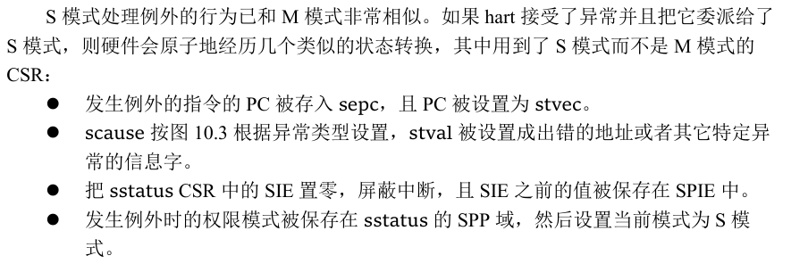
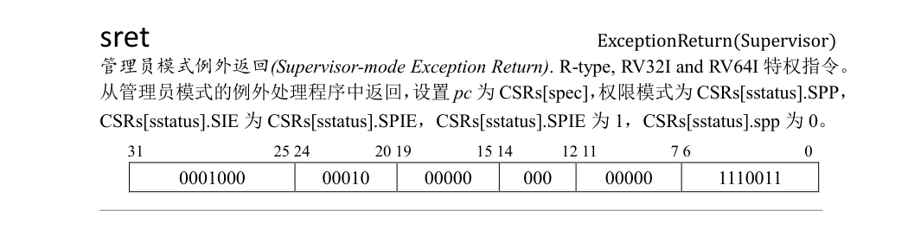

手动加载app(batch.rs::load_app)

[评论提问人](https://github.com/dunmengjun)

1. 关于fence.i的疑问, 它是清空i cache的. 代码中修改的内存是0x80400000, 但这个内存原本也没有存指令, 之前取指也不会从那里取, 这片内存不会进入i-cache，为什么需要？

> A:
>
> 在执行第一个应用之前清空icache确实没用，因为那个时候icache里面还没有相关内容。但是在执行后面应用的时候，icache里面就会缓存上一个应用的指令，因此需要手动清空它。

[评论提问人](https://github.com/dunmengjun)

2. 为什么我们要在应用程序的链接文件中设置0x80400000地址呢？

   之后在内核程序中我们是自己写代码手动去把应用程序从数据段copy到以 0x80400000 开头的位置的，按很自然的理解来说，copy之后只要把指令寄存器指向0x80400000，做一些初始化工作就应该可以运行了。为什么应用程序的链接文件中要指定0x80400000地址，明明内核中就手动copy到了这个地址。

   我的理解如果不在应用程序链接文件中设置BASE_ADDRESS，我只要保证应用程序入口点_start 的第一条指令在应用程序生成的bin文件的最前面，当我内核手动写代码 copy 这个应用程序 bin 文件到0x80400000之后就应该能运行

   不知道我理解是有什么问题? 为什么我们在应用程序链接文件中不设置0x80400000会报错？

   还有内核程序加载到内存我也一样很不理解为啥要在链接文件中设置BASE_ADDRESS， 因为我们的qemu命令中已经设置了啊，很困惑

> A:
>
> 因为目前我们生成的二进制文件并不是位置无关的，其中可能会存在一些绝对地址，这些绝对地址当且仅当程序被加载到内存中正确的位置时才是合法的。由于我们在内核中已经固定了程序被加载到的位置，所以程序自身也必须在编译时将起始地址设为同一个值，这样那些绝对的地址才能指向正确的代码和数据。
>
> 当然我们也许可以将二进制文件生成为位置无关的，但是内核在加载的时候根据其实际加载的位置可能需要对二进制文件中的某些符号进行动态重定位，这大概需要更加完善的二进制文件解析和修改功能，对于我们教学内核来说完全没有必要。目前这种直接拷贝的方法还是比较简单且恰当的。
>
> 从第四章开始我们就支持ELF加载了，在页表机制的帮助下，它能够支持任意的应用地址空间布局（包括rust默认的布局）。然而我们出于内存管理的方便仍然自定义了应用的地址空间布局。这些都可以看成内核功能所限因而不得不做出的取舍。

3. 这个fence.i指令清除指令缓存后会立即重新从内存中读入指令缓存块吗？如果是的话，那是不是应该将fence.i指令放到load_app函数末尾？

4. sscratch 是何时被设置为内核栈顶的？ 
手动加载app(batch.rs::load_app)

[评论提问人](https://github.com/dunmengjun)

1. 关于fence.i的疑问, 它是清空i cache的. 代码中修改的内存是0x80400000, 但这个内存原本也没有存指令, 之前取指也不会从那里取, 这片内存不会进入i-cache，为什么需要？

> A:
>
> 在执行第一个应用之前清空icache确实没用，因为那个时候icache里面还没有相关内容。但是在执行后面应用的时候，icache里面就会缓存上一个应用的指令，因此需要手动清空它。

[评论提问人](https://github.com/dunmengjun)

2. 为什么我们要在应用程序的链接文件中设置0x80400000地址呢？

   之后在内核程序中我们是自己写代码手动去把应用程序从数据段copy到以 0x80400000 开头的位置的，按很自然的理解来说，copy之后只要把指令寄存器指向0x80400000，做一些初始化工作就应该可以运行了。为什么应用程序的链接文件中要指定0x80400000地址，明明内核中就手动copy到了这个地址。

   我的理解如果不在应用程序链接文件中设置BASE_ADDRESS，我只要保证应用程序入口点_start 的第一条指令在应用程序生成的bin文件的最前面，当我内核手动写代码 copy 这个应用程序 bin 文件到0x80400000之后就应该能运行

   不知道我理解是有什么问题? 为什么我们在应用程序链接文件中不设置0x80400000会报错？

   还有内核程序加载到内存我也一样很不理解为啥要在链接文件中设置BASE_ADDRESS， 因为我们的qemu命令中已经设置了啊，很困惑

> A:
>
> 因为目前我们生成的二进制文件并不是位置无关的，其中可能会存在一些绝对地址，这些绝对地址当且仅当程序被加载到内存中正确的位置时才是合法的。由于我们在内核中已经固定了程序被加载到的位置，所以程序自身也必须在编译时将起始地址设为同一个值，这样那些绝对的地址才能指向正确的代码和数据。
>
> 当然我们也许可以将二进制文件生成为位置无关的，但是内核在加载的时候根据其实际加载的位置可能需要对二进制文件中的某些符号进行动态重定位，这大概需要更加完善的二进制文件解析和修改功能，对于我们教学内核来说完全没有必要。目前这种直接拷贝的方法还是比较简单且恰当的。
>
> 从第四章开始我们就支持ELF加载了，在页表机制的帮助下，它能够支持任意的应用地址空间布局（包括rust默认的布局）。然而我们出于内存管理的方便仍然自定义了应用的地址空间布局。这些都可以看成内核功能所限因而不得不做出的取舍。

3. 这个fence.i指令清除指令缓存后会立即重新从内存中读入指令缓存块吗？如果是的话，那是不是应该将fence.i指令放到load_app函数末尾？

4. sscratch 是何时被设置为内核栈顶的？ 

   sscratch 在完成各子系统初始化后，跳转到用户态之前设置为内核栈顶

5. sret 与 sepc 关系？

   > sepc：当 Trap 是一个异常的时候，记录 Trap 发生之前执行的最后一条指令的地址。

   > 特权级切换的硬件控制机制
   >
   > sepc 会被修改为 Trap 处理完成后默认会执行的下一条指令的地址。

   > 当 CPU 完成 Trap 处理准备返回的时候，通过一条 S 特权级的特权指令 `sret` 来完成。这一条指令具体完成以下功能：
   >
   > ```
   > ret: jalr x0, 0(x1)
   > 
   > x0 <- pc + 4
   > pc <- x1 + 0
   > ```
   >
   > - CPU 会将当前的特权级按照 `sstatus` 的 `SPP` 字段设置为 U 或者 S ；
   > - CPU 会跳转到 `sepc` 寄存器指向的那条指令，然后继续执行。

   ecall 后，x1 寄存器的值也是保存下一条指令，这与 sepc 的关系是什么呢？

   > 
   >
   > 
   >
   > - ecall 与 ra 没有直接的关系；这里 ra 保存的是属于用户态环境的地址；
   >
   > - 从管理员模式的例外处理程序中返回，设置 pc 为 CSRs[spec]；

   

   sscratch 在完成各子系统初始化后，跳转到用户态之前设置为内核栈顶

6. 补充：为什么 TarpContext 额外保持 sepc/sstatus

   > 对于 CSR 而言，进入 Trap 的时候，硬件会立即覆盖掉 `scause/stval/sstatus/sepc` 的全部或是其中一部分。
   >
   > `scause/stval` 的情况是：它总是在 Trap 处理的第一时间就被使用或者是在其他地方保存下来了，因此它没有被修改并造成不良影响的风险。
   >
   > 对于 `sstatus/sepc` 而言，它们会在 Trap 处理的全程有意义（在 Trap 控制流最后 `sret` 的时候还用到了它们），而且确实会出现 Trap 嵌套的情况使得它们的值被覆盖掉。所以我们需要将它们也一起保存下来，并在 `sret` 之前恢复原样。


7. os 下的 sys_write 与 user 下的 sys_write 实现差不多。

   use 的 syscall 与 os 的 sbi_call 实现基本一模一样；user 调用了一次 ecall，os 同样也是调用了一次 ecall，这也意味着os 进入 m 模式完成 sys_write 吗？

   > 是的，所有陷入都会进入 m 态，但 m 态可以选择不处理，也可以把它代理给 s 态，让 sbi 处理。


8. 为什么是 +4 而不是 +8 ？我们实现的不是 64 位 os 吗？

   > 查看 risc-v 实际是有 32 位 与 64 位 的 ecall 指令的：

   

   > 这里需要区分一下：riscv 指令长度只有 2 种，压缩的 16 位，不压缩的 32 位，与地址宽度无关；risc-v 64 是指地址宽度 64 位，寄存器宽度 64 位，但指令还是 32 位


9. 

   在 lib.rs 将函数符号 main 标志为弱链接，这样在最后链接的时候，虽然在 lib.rs 和 bin 目录下的某个应用程序都有 main 符号，但由于 lib.rs 中的 main 符号是弱链接，链接器会使用 bin 目录下的应用主逻辑作为 main。

   用户库的 main 返回值并非是符合 exits 参数 i32 的，那么：

   1. 用户的 main 与 lib.rs 的 main 有什么关系吗？

      > 由于 `lib.rs` 中的 `main` 符号是弱链接，链接器会使用 `bin` 目录下的应用主逻辑作为 `main`。这里我们主要是进行某种程度上的保护，如果在 `bin` 目录下找不到任何 `main` ，那么编译也能够通过，但会在运行时报错。

   2. 用户的 main 退出时与这里的 exit 有什么关系吗？

      > exit(main()) 会调用名字叫 main 的那个函数，链接器能决定这是哪个函数，所以它会调用 bin 里的 main，main 退出后执行 exit。

   3. 为什么用户库的 main 返回值并非是符合 exits 参数 i32，并不会报类型出错？

      > 猜测这里是因为 `extern "C" `的原因：c abi 的话可能只会检查函数名，并没有严格检查参数与返回值类型。