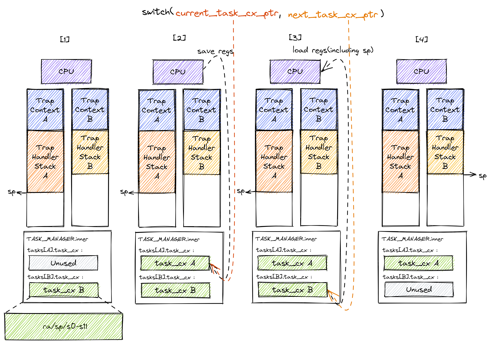
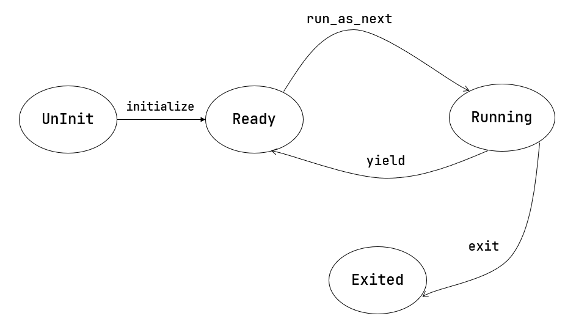

# 多道程序与分时多任务

操作系统在性能上的一系列功能改进：

- 通过提前加载应用程序到内存，减少应用程序切换开销
- 通过协作机制支持程序主动放弃处理器，提高系统执行效率
- 通过抢占机制支持程序被动放弃处理器，提高不同程序对处理器资源使用的公平性，也进一步提高了应用对 I/O 事件的响应效率

修改与支持

- 应用程序执行过程的管理

- 支持应用程序暂停的系统调用
- 主动切换应用程序所需的时钟中断机制的管理

具体差异

- 多个应用同时放在内存中，所以他们的起始地址是不同的，且地址范围不能重叠

  >需要对应用程序的地址空间布局进行调整，每个应用的地址空间都不相同，且不能重叠。
  >
  >通过一个脚本 `build.py` 来针对每个应用程序修改链接脚本 `linker.ld` 中的 `BASE_ADDRESS` ，让编译器在编译不同应用时用到的 `BASE_ADDRESS` 都不同，且有足够大的地址间隔

- 应用在整个执行过程中会暂停或被抢占，即会有主动或被动的任务切换

  >- 添加 Task 上下文切换。具体完成上下文切换的汇编语言编写的 `__switch` 函数。
  >
  >- 通过 `TaskControlBlock` 数据结构来表示应用执行上下文的动态执行过程和状态（运行态、就绪态等）。
  >
  >- 为了做好应用程序第一次执行的前期初始化准备， `TaskManager` 数据结构的全局变量实例 `TASK_MANAGER` 描述了应用程序初始化所需的数据， 而对 `TASK_MANAGER` 的初始化赋值过程是实现这个准备的关键步骤。
  >
  >- 应用程序可以在用户态执行中主动暂停，这需要有新的系统调用 `sys_yield` 的实现来支持
  >- 为了支持抢占应用执行的抢占式切换，还要添加对时钟中断的处理，在确定时间间隔内打断应用的执行，并主动切换到另外一个应用
  >- `TaskManager` 数据结构的成员函数 `run_next_task` 来具体实现基于任务控制块的任务切换，并会具体调用 `__switch` 函数完成硬件相关部分的任务上下文切换。

----

#### 多道程序放置

目前为 *绝对定位*

> - [两章区别](http://rcore-os.cn/rCore-Tutorial-Book-v3/chapter3/1multi-loader.html#:~:text=%E5%9C%A8%E7%AC%AC%E4%BA%8C%E7%AB%A0%E4%B8%AD%E5%BA%94%E7%94%A8%E7%9A%84%E5%8A%A0%E8%BD%BD%E5%92%8C%E6%89%A7%E8%A1%8C%E8%BF%9B%E5%BA%A6%E6%8E%A7%E5%88%B6%E9%83%BD%E4%BA%A4%E7%BB%99%20batch%20%E5%AD%90%E6%A8%A1%E5%9D%97%EF%BC%8C%E8%80%8C%E5%9C%A8%E7%AC%AC%E4%B8%89%E7%AB%A0%E4%B8%AD%E6%88%91%E4%BB%AC%E5%B0%86%E5%BA%94%E7%94%A8%E7%9A%84%E5%8A%A0%E8%BD%BD%E8%BF%99%E9%83%A8%E5%88%86%E5%8A%9F%E8%83%BD%E5%88%86%E7%A6%BB%E5%87%BA%E6%9D%A5%E5%9C%A8%20loader%20%E5%AD%90%E6%A8%A1%E5%9D%97%E4%B8%AD%E5%AE%9E%E7%8E%B0%EF%BC%8C%E5%BA%94%E7%94%A8%E7%9A%84%E6%89%A7%E8%A1%8C%E5%92%8C%E5%88%87%E6%8D%A2%E5%8A%9F%E8%83%BD%E5%88%99%E4%BA%A4%E7%BB%99%20task%20%E5%AD%90%E6%A8%A1%E5%9D%97%E3%80%82)
> - 程序与内存位置
>   - [绝对定位](https://nju-projectn.github.io/ics-pa-gitbook/ics2020/4.2.html#:~:text=%E6%AD%A3%E7%A1%AE%E8%BF%90%E8%A1%8C%E5%90%97%3F-,%E7%BB%9D%E5%AF%B9%E4%BB%A3%E7%A0%81,-%E4%B8%80%E8%88%AC%E6%9D%A5%E8%AF%B4%2C%20%E7%A8%8B%E5%BA%8F)
>   - [可重定位](https://nju-projectn.github.io/ics-pa-gitbook/ics2020/4.2.html#:~:text=%E6%88%90%E5%8A%9F%E5%8A%A0%E8%BD%BD.-,%E5%8F%AF%E9%87%8D%E5%AE%9A%E4%BD%8D%E4%BB%A3%E7%A0%81,-%E4%BD%86%E8%BF%99%E6%A0%B7%E5%A4%AA) - 运行时这样做能使得分时更加精细，但我们目前着重于保底机制：即任务运行了超过一个时间片一定会被切换，而不保证任务单次运行时间的下限。定位
>   - [位置无关代码](https://nju-projectn.github.io/ics-pa-gitbook/ics2020/4.2.html#:~:text=%E6%A8%A1%E5%9D%97%E7%9A%84.-,%E4%BD%8D%E7%BD%AE%E6%97%A0%E5%85%B3%E4%BB%A3%E7%A0%81,-%E4%BB%8E%E6%9F%90%E7%A7%8D%E7%A8%8B%E5%BA%A6) - 动态库 共享库
>   - [虚拟地址映射](https://nju-projectn.github.io/ics-pa-gitbook/ics2020/4.2.html#:~:text=%E7%9A%84%E6%96%B9%E6%A1%88%E5%91%A2%3F-,%E8%99%9A%E5%AE%9E%E4%BA%A4%E9%94%99%E7%9A%84%E9%AD%94%E6%B3%95,-%E6%88%91%E4%BB%AC%E5%88%9A%E6%89%8D%E6%98%AF) - OS + MMU

调整链接脚本：`linker.ld` 中的 `BASE_ADDRESS` 都是不同的 -> build.py

#### 多道程序加载

> [与上一章区别](http://rcore-os.cn/rCore-Tutorial-Book-v3/chapter3/1multi-loader.html#:~:text=%E4%B8%8A%E4%B8%80%E7%AB%A0%E4%B8%AD%E8%AE%B2%E8%A7%A3%E7%9A%84%E5%8A%A0%E8%BD%BD%E6%96%B9%E6%B3%95%E6%98%AF%E8%AE%A9%E6%89%80%E6%9C%89%E5%BA%94%E7%94%A8%E9%83%BD%E5%85%B1%E4%BA%AB%E5%90%8C%E4%B8%80%E4%B8%AA%E5%9B%BA%E5%AE%9A%E7%9A%84%E5%8A%A0%E8%BD%BD%E7%89%A9%E7%90%86%E5%9C%B0%E5%9D%80%E3%80%82%E4%B9%9F%E6%98%AF%E5%9B%A0%E4%B8%BA%E8%BF%99%E4%B8%AA%E5%8E%9F%E5%9B%A0%EF%BC%8C%E5%86%85%E5%AD%98%E4%B8%AD%E5%90%8C%E6%97%B6%E6%9C%80%E5%A4%9A%E5%8F%AA%E8%83%BD%E9%A9%BB%E7%95%99%E4%B8%80%E4%B8%AA%E5%BA%94%E7%94%A8%EF%BC%8C%E5%BD%93%E5%AE%83%E8%BF%90%E8%A1%8C%E5%AE%8C%E6%AF%95%E6%88%96%E8%80%85%E5%87%BA%E9%94%99%E9%80%80%E5%87%BA%E7%9A%84%E6%97%B6%E5%80%99%E7%94%B1%E6%93%8D%E4%BD%9C%E7%B3%BB%E7%BB%9F%E7%9A%84%20batch%20%E5%AD%90%E6%A8%A1%E5%9D%97%E5%8A%A0%E8%BD%BD%E4%B8%80%E4%B8%AA%E6%96%B0%E7%9A%84%E5%BA%94%E7%94%A8%E6%9D%A5%E6%9B%BF%E6%8D%A2%E6%8E%89%E5%AE%83%E3%80%82%E6%9C%AC%E7%AB%A0%E4%B8%AD%EF%BC%8C%E6%89%80%E6%9C%89%E7%9A%84%E5%BA%94%E7%94%A8%E5%9C%A8%E5%86%85%E6%A0%B8%E5%88%9D%E5%A7%8B%E5%8C%96%E7%9A%84%E6%97%B6%E5%80%99%E5%B0%B1%E4%B8%80%E5%B9%B6%E8%A2%AB%E5%8A%A0%E8%BD%BD%E5%88%B0%E5%86%85%E5%AD%98%E4%B8%AD%E3%80%82%E4%B8%BA%E4%BA%86%E9%81%BF%E5%85%8D%E8%A6%86%E7%9B%96%EF%BC%8C%E5%AE%83%E4%BB%AC%E8%87%AA%E7%84%B6%E9%9C%80%E8%A6%81%E8%A2%AB%E5%8A%A0%E8%BD%BD%E5%88%B0%E4%B8%8D%E5%90%8C%E7%9A%84%E7%89%A9%E7%90%86%E5%9C%B0%E5%9D%80%E3%80%82%E8%BF%99%E6%98%AF%E9%80%9A%E8%BF%87%E8%B0%83%E7%94%A8%20loader%20%E5%AD%90%E6%A8%A1%E5%9D%97%E7%9A%84%20load_apps%20%E5%87%BD%E6%95%B0%E5%AE%9E%E7%8E%B0%E7%9A%84%EF%BC%9A)

加载到不同物理地址 `loader.rs`：应用的内存布局从 APP_BASE_ADDRESS 开始依次为每个应用预留一段空间

#### 执行应用程序

操作系统知道每个应用程序预先加载在内存中的位置，这就需要设置应用程序返回的不同 Trap 上下文（Trap 上下文中保存了 放置程序起始地址的 `epc` 寄存器内容）：

- 跳转到应用程序 i 的入口点
- 将使用的栈切换到用户栈

[任务的概念形成](http://rcore-os.cn/rCore-Tutorial-Book-v3/chapter3/2task-switching.html#id2:~:text=%E5%88%B0%E8%BF%99%E9%87%8C%EF%BC%8C%E6%88%91%E4%BB%AC%E5%B0%B1%E6%8A%8A%E5%BA%94%E7%94%A8%E7%A8%8B%E5%BA%8F%E7%9A%84%E4%B8%80%E6%AC%A1%E6%89%A7%E8%A1%8C%E8%BF%87%E7%A8%8B%EF%BC%88%E4%B9%9F%E6%98%AF%E4%B8%80%E6%AE%B5%E6%8E%A7%E5%88%B6%E6%B5%81%EF%BC%89%E7%A7%B0%E4%B8%BA%E4%B8%80%E4%B8%AA%20%E4%BB%BB%E5%8A%A1%20%EF%BC%8C%E6%8A%8A%E5%BA%94%E7%94%A8%E6%89%A7%E8%A1%8C%E8%BF%87%E7%A8%8B%E4%B8%AD%E7%9A%84%E4%B8%80%E4%B8%AA%E6%97%B6%E9%97%B4%E7%89%87%E6%AE%B5%E4%B8%8A%E7%9A%84%E6%89%A7%E8%A1%8C%E7%89%87%E6%AE%B5%E6%88%96%E7%A9%BA%E9%97%B2%E7%89%87%E6%AE%B5%E7%A7%B0%E4%B8%BA%20%E2%80%9C%20%E8%AE%A1%E7%AE%97%E4%BB%BB%E5%8A%A1%E7%89%87%20%E2%80%9D%20%E6%88%96%E2%80%9C%20%E7%A9%BA%E9%97%B2%E4%BB%BB%E5%8A%A1%E7%89%87%20%E2%80%9D%20%E3%80%82%E5%BD%93%E5%BA%94%E7%94%A8%E7%A8%8B%E5%BA%8F%E7%9A%84%E6%89%80%E6%9C%89%E4%BB%BB%E5%8A%A1%E7%89%87%E9%83%BD%E5%AE%8C%E6%88%90%E5%90%8E%EF%BC%8C%E5%BA%94%E7%94%A8%E7%A8%8B%E5%BA%8F%E7%9A%84%E4%B8%80%E6%AC%A1%E4%BB%BB%E5%8A%A1%E4%B9%9F%E5%B0%B1%E5%AE%8C%E6%88%90%E4%BA%86%E3%80%82%E4%BB%8E%E4%B8%80%E4%B8%AA%E7%A8%8B%E5%BA%8F%E7%9A%84%E4%BB%BB%E5%8A%A1%E5%88%87%E6%8D%A2%E5%88%B0%E5%8F%A6%E5%A4%96%E4%B8%80%E4%B8%AA%E7%A8%8B%E5%BA%8F%E7%9A%84%E4%BB%BB%E5%8A%A1%E7%A7%B0%E4%B8%BA%20%E4%BB%BB%E5%8A%A1%E5%88%87%E6%8D%A2%20%E3%80%82%E4%B8%BA%E4%BA%86%E7%A1%AE%E4%BF%9D%E5%88%87%E6%8D%A2%E5%90%8E%E7%9A%84%E4%BB%BB%E5%8A%A1%E8%83%BD%E5%A4%9F%E6%AD%A3%E7%A1%AE%E7%BB%A7%E7%BB%AD%E6%89%A7%E8%A1%8C%EF%BC%8C%E6%93%8D%E4%BD%9C%E7%B3%BB%E7%BB%9F%E9%9C%80%E8%A6%81%E6%94%AF%E6%8C%81%E8%AE%A9%E4%BB%BB%E5%8A%A1%E7%9A%84%E6%89%A7%E8%A1%8C%E2%80%9C%E6%9A%82%E5%81%9C%E2%80%9D%E5%92%8C%E2%80%9C%E7%BB%A7%E7%BB%AD%E2%80%9D%E3%80%82)

[不同类型的上下文与切换](http://rcore-os.cn/rCore-Tutorial-Book-v3/chapter3/2task-switching.html#id2:~:text=%E6%96%87%E5%AD%97%E8%A1%A8%E8%BF%B0%E8%80%8C%E5%B7%B2%E3%80%82-,%E4%B8%8D%E5%90%8C%E7%B1%BB%E5%9E%8B%E7%9A%84%E4%B8%8A%E4%B8%8B%E6%96%87%E4%B8%8E%E5%88%87%E6%8D%A2,-%23)

#### 任务切换的设计与实现

- 任务切换 与 Trap 控制流切换 都是描述两条控制流之间的切换 

- 任务切换：不涉及特权级切换（与 trap 控制流切换不同）、它的一部分是由编译器帮忙完成的（不同）、它对应用是透明的（同）

- 任务切换是来自两个不同应用在内核中的 Trap 控制流之间的切换

-  [`__switch` 函数：换栈](http://rcore-os.cn/rCore-Tutorial-Book-v3/chapter3/2task-switching.html#id2:~:text=%E5%9C%A8%20__switch%20%E8%BF%94%E5%9B%9E%E4%B9%8B%E5%90%8E%EF%BC%8C%E5%B0%86%E7%BB%A7%E7%BB%AD%E4%BB%8E%E8%B0%83%E7%94%A8%E8%AF%A5%E5%87%BD%E6%95%B0%E7%9A%84%E4%BD%8D%E7%BD%AE%E7%BB%A7%E7%BB%AD%E5%90%91%E4%B8%8B%E6%89%A7%E8%A1%8C%E3%80%82%E4%BD%86%E6%98%AF%E5%85%B6%E9%97%B4%E5%8D%B4%E9%9A%90%E8%97%8F%E7%9D%80%E5%A4%8D%E6%9D%82%E7%9A%84%E6%8E%A7%E5%88%B6%E6%B5%81%E5%88%87%E6%8D%A2%E8%BF%87%E7%A8%8B%E3%80%82%E5%85%B7%E4%BD%93%E6%9D%A5%E8%AF%B4%EF%BC%8C%E8%B0%83%E7%94%A8%20__switch%20%E4%B9%8B%E5%90%8E%E7%9B%B4%E5%88%B0%E5%AE%83%E8%BF%94%E5%9B%9E%E5%89%8D%E7%9A%84%E8%BF%99%E6%AE%B5%E6%97%B6%E9%97%B4%EF%BC%8C%E5%8E%9F%20Trap%20%E6%8E%A7%E5%88%B6%E6%B5%81%20A%20%E4%BC%9A%E5%85%88%E8%A2%AB%E6%9A%82%E5%81%9C%E5%B9%B6%E8%A2%AB%E5%88%87%E6%8D%A2%E5%87%BA%E5%8E%BB%EF%BC%8C%20CPU%20%E8%BD%AC%E8%80%8C%E8%BF%90%E8%A1%8C%E5%8F%A6%E4%B8%80%E4%B8%AA%E5%BA%94%E7%94%A8%E5%9C%A8%E5%86%85%E6%A0%B8%E4%B8%AD%E7%9A%84%20Trap%20%E6%8E%A7%E5%88%B6%E6%B5%81%20B%20%E3%80%82%E7%84%B6%E5%90%8E%E5%9C%A8%E6%9F%90%E4%B8%AA%E5%90%88%E9%80%82%E7%9A%84%E6%97%B6%E6%9C%BA%EF%BC%8C%E5%8E%9F%20Trap%20%E6%8E%A7%E5%88%B6%E6%B5%81%20A%20%E6%89%8D%E4%BC%9A%E4%BB%8E%E6%9F%90%E4%B8%80%E6%9D%A1%20Trap%20%E6%8E%A7%E5%88%B6%E6%B5%81%20C%20%EF%BC%88%E5%BE%88%E6%9C%89%E5%8F%AF%E8%83%BD%E4%B8%8D%E6%98%AF%E5%AE%83%E4%B9%8B%E5%89%8D%E5%88%87%E6%8D%A2%E5%88%B0%E7%9A%84%20B%20%EF%BC%89%E5%88%87%E6%8D%A2%E5%9B%9E%E6%9D%A5%E7%BB%A7%E7%BB%AD%E6%89%A7%E8%A1%8C%E5%B9%B6%E6%9C%80%E7%BB%88%E8%BF%94%E5%9B%9E%E3%80%82%E4%B8%8D%E8%BF%87%EF%BC%8C%E4%BB%8E%E5%AE%9E%E7%8E%B0%E7%9A%84%E8%A7%92%E5%BA%A6%E8%AE%B2%EF%BC%8C%20__switch%20%E5%87%BD%E6%95%B0%E5%92%8C%E4%B8%80%E4%B8%AA%E6%99%AE%E9%80%9A%E7%9A%84%E5%87%BD%E6%95%B0%E4%B9%8B%E9%97%B4%E7%9A%84%E6%A0%B8%E5%BF%83%E5%B7%AE%E5%88%AB%E4%BB%85%E4%BB%85%E6%98%AF%E5%AE%83%E4%BC%9A%20%E6%8D%A2%E6%A0%88%20%E3%80%82)

1. 在准备调用 `__switch` 函数之前，内核栈上从栈底到栈顶分别是保存了应用执行状态的 Trap 上下文以及内核在对 Trap 处理的过程中留下的调用栈信息。
2. 由于之后还要恢复回来执行，我们必须保存 CPU 当前的某些寄存器，我们称它们为 **任务上下文** (Task Context)。
3. 上下文保存的位置：任务管理器 `TaskManager` ，在里面能找到一个数组 `tasks` ，其中的每一项都是一个任务控制块，即 `TaskControlBlock` ，它负责保存一个任务的状态，而任务上下文 `TaskContext` 被保存在任务控制块中。
4. 在内核运行时会初始化 `TaskManager` 的全局实例 `TASK_MANAGER` ，因此所有任务上下文实际保存在在 `TASK_MANAGER` 中，从内存布局来看则是放在内核的全局数据 `.data` 段中。
5. 当任务上下文保存完毕之后则转化为右侧的状态。
6. 当要从其他任务切换回来继续执行这个任务的时候，CPU 会读取同样的位置并从中恢复任务上下文。

Trap 控制流在调用 `__switch` 之前就需要明确知道即将切换到哪一条目前正处于暂停状态的 Trap 控制流，因此 `__switch` 有两个参数，第一个参数代表它自己，第二个参数则代表即将切换到的那条 Trap 控制流。(寄存器a0, a1)

在图中，假设某次 `__switch` 调用要从 Trap 控制流 A 切换到 B，一共可以分为四个阶段，在每个阶段中我们都给出了 A 和 B 内核栈上的内容。

阶段 [1]：在 Trap 控制流 A 调用 `__switch` 之前，A 的内核栈上只有 Trap 上下文和 Trap 处理函数的调用栈信息，而 B 是之前被切换出去的；

阶段 [2]：A 在 A 任务上下文空间在里面保存 CPU 当前的寄存器快照；

阶段 [3]：读取 `next_task_cx_ptr` 指向的 B 任务上下文，根据 B 任务上下文保存的内容来恢复 `ra` 寄存器、`s0~s11` 寄存器以及 `sp` 寄存器。只有这一步做完后， `__switch` 才能做到一个函数跨两条控制流执行，即 *通过换栈也就实现了控制流的切换* 。

阶段 [4]：上一步寄存器恢复完成后，可以看到通过恢复 `sp` 寄存器换到了任务 B 的内核栈上，进而实现了控制流的切换。这就是为什么 `__switch` 能做到一个函数跨两条控制流执行。此后，当 CPU 执行 `ret` 汇编伪指令完成 `__switch` 函数返回后，任务 B 可以从调用 `__switch` 的位置继续向下执行。

从结果来看，我们看到 A 控制流 和 B 控制流的状态发生了互换， A 在保存任务上下文之后进入暂停状态，而 B 则恢复了上下文并在 CPU 上继续执行。

> 任务上下文 寄存器的保存
>
> - 使用 `ra` 寄存器（即 `x1` 寄存器）保存返回地址: ra 记录了 __switch 函数返回之后应该跳转到哪里继续执行，从而在任务切换完成并 ret 之后能到正确的位置；
> - s0~s11 作为临时寄存器使用，被调函数保存后才能在被调函数中使用。对于一般的函数而言，Rust/C 编译器会在函数的起始位置自动生成代码来保存 s0~s11 这些被调用者保存的寄存器。但 switch 是一个用汇编代码写的特殊函数，它不会被 Rust/C 编译器处理，所以我们需要在 switch 中手动编写保存 s0~s11 的汇编代码；
> - 其它寄存器中，属于调用者保存的寄存器是由编译器在高级语言编写的调用函数中自动生成的代码来完成保存的 (a0 ~ a7)；我们通过 `extern "C"` 来使用 `__switch` 函数完成切换功能，而不是直接跳转到符号 __switch 的地址。因此在调用前后 Rust 编译器会自动帮助我们插入保存/恢复调用者保存寄存器的汇编代码
> - 还有一些寄存器属于临时寄存器 (t0 ~ t6)，不需要保存和恢复

> 当内核仅运行单个应用的时候，无论该任务主动/被动交出 CPU 资源最终都会交还给自己，这将导致传给 `__switch` 的两个参数相同，也就是某个 Trap 控制流自己切换到自己的情形，所以怎样处理这种情况？

---

### 多道程序与协作式调度

任务切换 -> 将其封装为一个函数 __switch

何时调用该函数，以及如何确定传入函数的两个参数——分别代表 正待换出 和 即将被换入 的两条 Trap 控制流

任务运行状态：任务从开始到结束执行过程中所处的不同运行状态：未初始化、准备执行、正在执行、已退出

任务控制块：管理程序的执行过程的任务上下文，控制程序的执行与暂停

任务相关系统调用：应用程序和操作系统直接的接口，用于程序主动暂停 `sys_yield` 和主动退出 `sys_exit`

#### 多道程序背景与 yield 系统调用

[忙等 的含义](http://rcore-os.cn/rCore-Tutorial-Book-v3/chapter3/3multiprogramming.html#:~:text=%E5%9C%A8%20CPU%20%E5%AF%B9%E5%A4%96%E8%AE%BE%E5%8F%91%E5%87%BA%E4%BA%86%20I/O%20%E8%AF%B7%E6%B1%82%E4%B9%8B%E5%90%8E%EF%BC%8C%E7%94%B1%E4%BA%8E%20CPU%20%E9%80%9F%E5%BA%A6%E8%BF%9C%E5%BF%AB%E4%BA%8E%E5%A4%96%E8%AE%BE%E9%80%9F%E5%BA%A6%EF%BC%8C%E4%BD%BF%E5%BE%97%20CPU%20%E4%B8%8D%E8%83%BD%E7%AB%8B%E5%8D%B3%E7%BB%A7%E7%BB%AD%E6%89%A7%E8%A1%8C%EF%BC%8C%E8%80%8C%E6%98%AF%E8%A6%81%E7%AD%89%E5%BE%85%EF%BC%88%E5%BF%99%E7%AD%89%E6%88%96%E7%9D%A1%E7%9C%A0%E7%AD%89%EF%BC%89%E5%A4%96%E8%AE%BE%E5%B0%86%E8%AF%B7%E6%B1%82%E5%A4%84%E7%90%86%E5%AE%8C%E6%AF%95%E5%B9%B6%E6%8B%BF%E5%88%B0%E5%AE%8C%E6%95%B4%E7%9A%84%E5%A4%84%E7%90%86%E7%BB%93%E6%9E%9C%E4%B9%8B%E5%90%8E%E6%89%8D%E8%83%BD%E7%BB%A7%E7%BB%AD%E3%80%82%E9%82%A3%E4%B9%88%E5%A6%82%E4%BD%95%E7%9F%A5%E9%81%93%E5%A4%96%E8%AE%BE%E6%98%AF%E5%90%A6%E5%B7%B2%E7%BB%8F%E5%AE%8C%E6%88%90%E4%BA%86%E8%AF%B7%E6%B1%82%E5%91%A2%EF%BC%9F%E9%80%9A%E5%B8%B8%E5%A4%96%E8%AE%BE%E4%BC%9A%E6%8F%90%E4%BE%9B%E4%B8%80%E4%B8%AA%E5%8F%AF%E8%AF%BB%E7%9A%84%E5%AF%84%E5%AD%98%E5%99%A8%E8%AE%B0%E5%BD%95%E5%AE%83%E7%9B%AE%E5%89%8D%E7%9A%84%E5%B7%A5%E4%BD%9C%E7%8A%B6%E6%80%81%EF%BC%8C%E4%BA%8E%E6%98%AF%20CPU%20%E9%9C%80%E8%A6%81%E4%B8%8D%E6%96%AD%E5%8E%9F%E5%9C%B0%E5%BE%AA%E7%8E%AF%E8%AF%BB%E5%8F%96%E5%AE%83%E7%9B%B4%E5%88%B0%E5%AE%83%E7%9A%84%E7%BB%93%E6%9E%9C%E6%98%BE%E7%A4%BA%E8%AE%BE%E5%A4%87%E5%B7%B2%E7%BB%8F%E5%B0%86%E8%AF%B7%E6%B1%82%E5%A4%84%E7%90%86%E5%AE%8C%E6%AF%95%E4%BA%86%EF%BC%8C%E6%89%8D%E8%83%BD%E7%BB%A7%E7%BB%AD%E6%89%A7%E8%A1%8C%EF%BC%88%E8%BF%99%E5%B0%B1%E6%98%AF%20%E5%BF%99%E7%AD%89%20%E7%9A%84%E5%90%AB%E4%B9%89%EF%BC%89) -> [利用率不足](http://rcore-os.cn/rCore-Tutorial-Book-v3/chapter3/3multiprogramming.html#:~:text=%E3%80%82%E7%84%B6%E8%80%8C%EF%BC%8C%E5%A4%96%E8%AE%BE%E7%9A%84%E8%AE%A1%E7%AE%97%E9%80%9F%E5%BA%A6%E5%92%8C%20CPU%20%E7%9B%B8%E6%AF%94%E5%8F%AF%E8%83%BD%E6%85%A2%E4%BA%86%E5%87%A0%E4%B8%AA%E6%95%B0%E9%87%8F%E7%BA%A7%EF%BC%8C%E8%BF%99%E5%B0%B1%E5%AF%BC%E8%87%B4%20CPU%20%E6%9C%89%E5%A4%A7%E9%87%8F%E6%97%B6%E9%97%B4%E6%B5%AA%E8%B4%B9%E5%9C%A8%E7%AD%89%E5%BE%85%E5%A4%96%E8%AE%BE%E8%BF%99%E4%BB%B6%E4%BA%8B%E6%83%85%E4%B8%8A%EF%BC%8C%E8%BF%99%E6%AE%B5%E6%97%B6%E9%97%B4%E5%AE%83%E5%87%A0%E4%B9%8E%E6%B2%A1%E6%9C%89%E5%81%9A%E4%BB%BB%E4%BD%95%E4%BA%8B%E6%83%85%EF%BC%8C%E4%B9%9F%E5%9C%A8%E4%B8%80%E5%AE%9A%E7%A8%8B%E5%BA%A6%E4%B8%8A%E9%80%A0%E6%88%90%E4%BA%86%20CPU%20%E7%9A%84%E5%88%A9%E7%94%A8%E7%8E%87%E4%B8%8D%E5%A4%9F%E7%90%86%E6%83%B3%E3%80%82)

[协作式多道程序](http://rcore-os.cn/rCore-Tutorial-Book-v3/chapter3/3multiprogramming.html#:~:text=%E5%A4%9A%E9%81%93%E7%A8%8B%E5%BA%8F%E7%9A%84%E6%80%9D%E6%83%B3%E5%9C%A8%E4%BA%8E%EF%BC%9A%E5%86%85%E6%A0%B8%E5%90%8C%E6%97%B6%E7%AE%A1%E7%90%86%E5%A4%9A%E4%B8%AA%E5%BA%94%E7%94%A8%E3%80%82%E5%A6%82%E6%9E%9C%E5%A4%96%E8%AE%BE%E5%A4%84%E7%90%86%20I/O%20%E7%9A%84%E6%97%B6%E9%97%B4%E8%B6%B3%E5%A4%9F%E9%95%BF%EF%BC%8C%E9%82%A3%E6%88%91%E4%BB%AC%E5%8F%AF%E4%BB%A5%E5%85%88%E8%BF%9B%E8%A1%8C%E4%BB%BB%E5%8A%A1%E5%88%87%E6%8D%A2%E5%8E%BB%E6%89%A7%E8%A1%8C%E5%85%B6%E4%BB%96%E5%BA%94%E7%94%A8%EF%BC%9B%E5%9C%A8%E6%9F%90%E6%AC%A1%E5%88%87%E6%8D%A2%E5%9B%9E%E6%9D%A5%E4%B9%8B%E5%90%8E%EF%BC%8C%E5%BA%94%E7%94%A8%E5%86%8D%E6%AC%A1%E8%AF%BB%E5%8F%96%E8%AE%BE%E5%A4%87%E5%AF%84%E5%AD%98%E5%99%A8%EF%BC%8C%E5%8F%91%E7%8E%B0%20I/O%20%E8%AF%B7%E6%B1%82%E5%B7%B2%E7%BB%8F%E5%A4%84%E7%90%86%E5%AE%8C%E6%AF%95%E4%BA%86%EF%BC%8C%E9%82%A3%E4%B9%88%E5%B0%B1%E5%8F%AF%E4%BB%A5%E6%A0%B9%E6%8D%AE%E8%BF%94%E5%9B%9E%E7%9A%84%20I/O%20%E7%BB%93%E6%9E%9C%E7%BB%A7%E7%BB%AD%E5%90%91%E4%B8%8B%E6%89%A7%E8%A1%8C%E4%BA%86%E3%80%82%E8%BF%99%E6%A0%B7%E7%9A%84%E8%AF%9D%EF%BC%8C%E5%8F%AA%E8%A6%81%E5%90%8C%E6%97%B6%E5%AD%98%E5%9C%A8%E7%9A%84%E5%BA%94%E7%94%A8%E8%B6%B3%E5%A4%9F%E5%A4%9A%EF%BC%8C%E5%B0%B1%E8%83%BD%E4%B8%80%E5%AE%9A%E7%A8%8B%E5%BA%A6%E4%B8%8A%E9%9A%90%E8%97%8F%20I/O%20%E5%A4%96%E8%AE%BE%E5%A4%84%E7%90%86%E7%9B%B8%E5%AF%B9%E4%BA%8E%20CPU%20%E7%9A%84%E5%BB%B6%E8%BF%9F%EF%BC%8C%E4%BF%9D%E8%AF%81%20CPU%20%E4%B8%8D%E5%BF%85%E6%B5%AA%E8%B4%B9%E6%97%B6%E9%97%B4%E5%9C%A8%E7%AD%89%E5%BE%85%E5%A4%96%E8%AE%BE%E4%B8%8A%EF%BC%8C%E8%80%8C%E6%98%AF%E5%87%A0%E4%B9%8E%E4%B8%80%E7%9B%B4%E5%9C%A8%E8%BF%9B%E8%A1%8C%E8%AE%A1%E7%AE%97%E3%80%82%E8%BF%99%E7%A7%8D%E4%BB%BB%E5%8A%A1%E5%88%87%E6%8D%A2%EF%BC%8C%E6%98%AF%E8%AE%A9%E5%BA%94%E7%94%A8%20%E4%B8%BB%E5%8A%A8%20%E8%B0%83%E7%94%A8%20sys_yield%20%E7%B3%BB%E7%BB%9F%E8%B0%83%E7%94%A8%E6%9D%A5%E5%AE%9E%E7%8E%B0%E7%9A%84%EF%BC%8C%E8%BF%99%E6%84%8F%E5%91%B3%E7%9D%80%E5%BA%94%E7%94%A8%E4%B8%BB%E5%8A%A8%E4%BA%A4%E5%87%BA%20CPU%20%E7%9A%84%E4%BD%BF%E7%94%A8%E6%9D%83%E7%BB%99%E5%85%B6%E4%BB%96%E5%BA%94%E7%94%A8%E3%80%82) -> [sys_yield](http://rcore-os.cn/rCore-Tutorial-Book-v3/chapter3/3multiprogramming.html#:~:text=%E4%B8%80%E4%B8%AA%E5%BA%94%E7%94%A8%E4%BC%9A%E6%8C%81%E7%BB%AD%E8%BF%90%E8%A1%8C%E4%B8%8B%E5%8E%BB%EF%BC%8C%E7%9B%B4%E5%88%B0%E5%AE%83%E4%B8%BB%E5%8A%A8%E8%B0%83%E7%94%A8%20sys_yield%20%E7%B3%BB%E7%BB%9F%E8%B0%83%E7%94%A8%E6%9D%A5%E4%BA%A4%E5%87%BA%20CPU%20%E4%BD%BF%E7%94%A8%E6%9D%83%E3%80%82%E5%86%85%E6%A0%B8%E5%B0%86%E5%BE%88%E5%A4%A7%E7%9A%84%E6%9D%83%E5%8A%9B%E4%B8%8B%E6%94%BE%E5%88%B0%E5%BA%94%E7%94%A8%EF%BC%8C%E8%AE%A9%E6%89%80%E6%9C%89%E7%9A%84%E5%BA%94%E7%94%A8%E4%BA%92%E7%9B%B8%E5%8D%8F%E4%BD%9C%E6%9D%A5%E6%9C%80%E7%BB%88%E8%BE%BE%E6%88%90%E6%9C%80%E5%A4%A7%E5%8C%96%20CPU%20%E5%88%A9%E7%94%A8%E7%8E%87%EF%BC%8C%E5%85%85%E5%88%86%E5%88%A9%E7%94%A8%E8%AE%A1%E7%AE%97%E8%B5%84%E6%BA%90%E8%BF%99%E4%B8%80%E7%BB%88%E6%9E%81%E7%9B%AE%E6%A0%87)

> **sys_yield 的缺点**
>
> 当应用调用它主动交出 CPU 使用权之后，它下一次再被允许使用 CPU 的时间点与内核的调度策略与当前的总体应用执行情况有关，很有可能远远迟于该应用等待的事件（如外设处理完请求）达成的时间点。这就会造成该应用的响应延迟不稳定或者很长。
>
> (进程调度)

#### 任务控制块与任务运行状态

[维护运行状态](http://rcore-os.cn/rCore-Tutorial-Book-v3/chapter3/3multiprogramming.html#:~:text=%E4%B8%80%E6%AE%B5%E6%97%B6%E9%97%B4%E5%86%85%EF%BC%8C%E5%86%85%E6%A0%B8%E9%9C%80%E8%A6%81%E7%AE%A1%E7%90%86%E5%A4%9A%E4%B8%AA%E6%9C%AA%E5%AE%8C%E6%88%90%E7%9A%84%E5%BA%94%E7%94%A8%EF%BC%8C%E8%80%8C%E4%B8%94%E6%88%91%E4%BB%AC%E4%B8%8D%E8%83%BD%E5%AF%B9%E5%BA%94%E7%94%A8%E5%AE%8C%E6%88%90%E7%9A%84%E9%A1%BA%E5%BA%8F%E5%81%9A%E4%BB%BB%E4%BD%95%E5%81%87%E5%AE%9A%EF%BC%8C%E5%B9%B6%E4%B8%8D%E6%98%AF%E5%85%88%E5%8A%A0%E5%85%A5%E7%9A%84%E5%BA%94%E7%94%A8%E5%B0%B1%E4%B8%80%E5%AE%9A%E4%BC%9A%E5%85%88%E5%AE%8C%E6%88%90%E3%80%82%E8%BF%99%E7%A7%8D%E6%83%85%E5%86%B5%E4%B8%8B%EF%BC%8C%E6%88%91%E4%BB%AC%E5%BF%85%E9%A1%BB%E5%9C%A8%E5%86%85%E6%A0%B8%E4%B8%AD%E5%AF%B9%E6%AF%8F%E4%B8%AA%E5%BA%94%E7%94%A8%E5%88%86%E5%88%AB%E7%BB%B4%E6%8A%A4%E5%AE%83%E7%9A%84%E8%BF%90%E8%A1%8C%E7%8A%B6%E6%80%81%EF%BC%8C%E7%9B%AE%E5%89%8D%E6%9C%89%E5%A6%82%E4%B8%8B%E5%87%A0%E7%A7%8D%EF%BC%9A)

> [变量与常量分离的编程风格](http://rcore-os.cn/rCore-Tutorial-Book-v3/chapter3/3multiprogramming.html#:~:text=%E5%AD%97%E6%AE%B5%20num_app%20%E4%BB%8D%E7%84%B6%E8%A1%A8%E7%A4%BA%E4%BB%BB%E5%8A%A1%E7%AE%A1%E7%90%86%E5%99%A8%E7%AE%A1%E7%90%86%E7%9A%84%E5%BA%94%E7%94%A8%E7%9A%84%E6%95%B0%E7%9B%AE%EF%BC%8C%E5%AE%83%E5%9C%A8%20TaskManager%20%E5%88%9D%E5%A7%8B%E5%8C%96%E4%B9%8B%E5%90%8E%E5%B0%B1%E4%B8%8D%E4%BC%9A%E5%8F%91%E7%94%9F%E5%8F%98%E5%8C%96%EF%BC%9B%E8%80%8C%E5%8C%85%E8%A3%B9%E5%9C%A8%20TaskManagerInner%20%E5%86%85%E7%9A%84%E4%BB%BB%E5%8A%A1%E6%8E%A7%E5%88%B6%E5%9D%97%E6%95%B0%E7%BB%84%20tasks%20%E4%BB%A5%E5%8F%8A%E8%A1%A8%E7%A4%BA%20CPU%20%E6%AD%A3%E5%9C%A8%E6%89%A7%E8%A1%8C%E7%9A%84%E5%BA%94%E7%94%A8%E7%BC%96%E5%8F%B7%20current_task%20%E4%BC%9A%E5%9C%A8%E6%89%A7%E8%A1%8C%E5%BA%94%E7%94%A8%E7%9A%84%E8%BF%87%E7%A8%8B%E4%B8%AD%E5%8F%91%E7%94%9F%E5%8F%98%E5%8C%96%EF%BC%9A%E6%AF%8F%E4%B8%AA%E5%BA%94%E7%94%A8%E7%9A%84%E8%BF%90%E8%A1%8C%E7%8A%B6%E6%80%81%E9%83%BD%E4%BC%9A%E5%8F%91%E7%94%9F%E5%8F%98%E5%8C%96%EF%BC%8C%E8%80%8C%20CPU%20%E6%89%A7%E8%A1%8C%E7%9A%84%E5%BA%94%E7%94%A8%E4%B9%9F%E5%9C%A8%E4%B8%8D%E6%96%AD%E5%88%87%E6%8D%A2%E3%80%82%E5%9B%A0%E6%AD%A4%E6%88%91%E4%BB%AC%E9%9C%80%E8%A6%81%E5%B0%86%20TaskManagerInner%20%E5%8C%85%E8%A3%B9%E5%9C%A8%20UPSafeCell%20%E5%86%85%E4%BB%A5%E8%8E%B7%E5%8F%96%E5%85%B6%E5%86%85%E9%83%A8%E5%8F%AF%E5%8F%98%E6%80%A7%E4%BB%A5%E5%8F%8A%E5%8D%95%E6%A0%B8%E4%B8%8A%E5%AE%89%E5%85%A8%E7%9A%84%E8%BF%90%E8%A1%8C%E6%97%B6%E5%80%9F%E7%94%A8%E6%A3%80%E6%9F%A5%E8%83%BD%E5%8A%9B%E3%80%82)

状态变换

#### 第一次进入用户态

[第一次运行](http://rcore-os.cn/rCore-Tutorial-Book-v3/chapter3/3multiprogramming.html#term-coop-impl:~:text=%E5%BD%93%E8%A2%AB%E4%BB%BB%E5%8A%A1%E5%88%87%E6%8D%A2%E5%87%BA%E5%8E%BB%E7%9A%84%E5%BA%94%E7%94%A8%E5%8D%B3%E5%B0%86%E5%86%8D%E6%AC%A1%E8%BF%90%E8%A1%8C%E7%9A%84%E6%97%B6%E5%80%99%EF%BC%8C%E5%AE%83%E5%AE%9E%E9%99%85%E4%B8%8A%E6%98%AF%E9%80%9A%E8%BF%87%20__switch%20%E5%87%BD%E6%95%B0%E5%8F%88%E5%AE%8C%E6%88%90%E4%B8%80%E6%AC%A1%E4%BB%BB%E5%8A%A1%E5%88%87%E6%8D%A2%EF%BC%8C%E5%8F%AA%E6%98%AF%E8%BF%99%E6%AC%A1%E6%98%AF%E8%A2%AB%E5%88%87%E6%8D%A2%E8%BF%9B%E6%9D%A5%EF%BC%8C%E5%8F%96%E5%BE%97%E4%BA%86%20CPU%20%E7%9A%84%E4%BD%BF%E7%94%A8%E6%9D%83%E3%80%82%E5%A6%82%E6%9E%9C%E8%AF%A5%E5%BA%94%E7%94%A8%E6%98%AF%E4%B9%8B%E5%89%8D%E8%A2%AB%E5%88%87%E6%8D%A2%E5%87%BA%E5%8E%BB%E7%9A%84%EF%BC%8C%E9%82%A3%E4%B9%88%E5%AE%83%E9%9C%80%E8%A6%81%E6%9C%89%E4%BB%BB%E5%8A%A1%E4%B8%8A%E4%B8%8B%E6%96%87%E5%92%8C%E5%86%85%E6%A0%B8%E6%A0%88%E4%B8%8A%E7%9A%84%20Trap%20%E4%B8%8A%E4%B8%8B%E6%96%87%EF%BC%8C%E8%AE%A9%E5%88%87%E6%8D%A2%E6%9C%BA%E5%88%B6%E5%8F%AF%E4%BB%A5%E6%AD%A3%E5%B8%B8%E5%B7%A5%E4%BD%9C%E3%80%82%E4%BD%86%E6%98%AF%E5%A6%82%E6%9E%9C%E5%BA%94%E7%94%A8%E6%98%AF%E7%AC%AC%E4%B8%80%E6%AC%A1%E8%A2%AB%E6%89%A7%E8%A1%8C%EF%BC%8C%E9%82%A3%E5%86%85%E6%A0%B8%E5%BA%94%E8%AF%A5%E6%80%8E%E4%B9%88%E5%8A%9E%E5%91%A2%EF%BC%9F%E7%B1%BB%E4%BC%BC%E6%9E%84%E9%80%A0%20Trap%20%E4%B8%8A%E4%B8%8B%E6%96%87%E7%9A%84%E6%96%B9%E6%B3%95%EF%BC%8C%E5%86%85%E6%A0%B8%E9%9C%80%E8%A6%81%E5%9C%A8%E5%BA%94%E7%94%A8%E7%9A%84%E4%BB%BB%E5%8A%A1%E6%8E%A7%E5%88%B6%E5%9D%97%E4%B8%8A%E6%9E%84%E9%80%A0%E4%B8%80%E4%B8%AA%E7%94%A8%E4%BA%8E%E7%AC%AC%E4%B8%80%E6%AC%A1%E6%89%A7%E8%A1%8C%E7%9A%84%E4%BB%BB%E5%8A%A1%E4%B8%8A%E4%B8%8B%E6%96%87%E3%80%82%E6%88%91%E4%BB%AC%E6%98%AF%E5%9C%A8%E5%88%9B%E5%BB%BA%20TaskManager%20%E7%9A%84%E5%85%A8%E5%B1%80%E5%AE%9E%E4%BE%8B%20TASK_MANAGER%20%E7%9A%84%E6%97%B6%E5%80%99%E6%9D%A5%E8%BF%9B%E8%A1%8C%E8%BF%99%E4%B8%AA%E5%88%9D%E5%A7%8B%E5%8C%96%E7%9A%84%E3%80%82)

- 类似构造 Trap 上下文的方法，内核需要在应用的任务控制块上构造一个用于第一次执行的任务上下文；
- 对于每个任务，我们先调用 `init_app_cx` 构造该任务的 Trap 上下文（包括应用入口地址和用户栈指针）并将其压入到内核栈顶；
- 接着调用 `TaskContext::goto_restore` 来构造每个任务保存在任务控制块中的任务上下文：它设置任务上下文中的内核栈指针将任务上下文的 `ra` 寄存器设置为 `__restore` 的入口地址。这样，在 `__switch` 从它上面恢复并返回之后就会直接跳转到 `__restore` ，此时栈顶是一个我们构造出来第一次进入用户态执行的 Trap 上下文，就和第二章的情况一样了。

> 注意 `__switch` 有两个参数分别表示当前应用和即将切换到的应用的任务上下文指针，其第一个参数存在的意义是记录当前应用的任务上下文被保存在哪里，也就是当前应用内核栈的栈顶，这样之后才能继续执行该应用。
>
> 但在 `run_first_task` 的时候，我们并没有执行任何应用， `__switch` 前半部分的保存仅仅是在启动栈上保存了一些之后不会用到的数据，自然也无需记录启动栈栈顶的位置。
>
> 因此，我们显式在启动栈上分配了一个名为 `_unused` 的任务上下文，并将它的地址作为第一个参数传给 `__switch` ，这样保存一些寄存器之后的启动栈栈顶的位置将会保存在此变量中。
>
> 然而无论是此变量还是启动栈我们之后均不会涉及到，一旦应用开始运行，我们就开始在应用的用户栈和内核栈之间开始切换了。这里声明此变量的意义仅仅是为了避免覆盖到其他数据。

#### 分时多任务系统的背景

吞吐量（Throughput）、 交互式应用 (Interactive Application)、延迟 （Latency）、协作式调度 (Cooperative Scheduling) 、抢占式调度 (Preemptive Scheduling)、时间片 (Time Slice)

[链接](http://rcore-os.cn/rCore-Tutorial-Book-v3/chapter3/4time-sharing-system.html#:~:text=%E4%B8%8A%E4%B8%80%E8%8A%82%E6%88%91%E4%BB%AC%E4%BB%8B%E7%BB%8D%E4%BA%86%E5%A4%9A,%E6%AF%94%E4%B8%8D%E5%BA%94%E5%B7%AE%E8%B7%9D%E8%BF%87%E5%A4%A7%E3%80%82)

[RISC-V 架构中的中断](http://rcore-os.cn/rCore-Tutorial-Book-v3/chapter3/4time-sharing-system.html#risc-v:~:text=%E5%88%86%E6%94%AF%E4%B8%8A%E6%89%BE%E5%88%B0%E3%80%82-,RISC%2DV%20%E6%9E%B6%E6%9E%84%E4%B8%AD%E7%9A%84%E4%B8%AD%E6%96%AD,-%23)

#### 时钟中断与计时器

`os/src/timer.rs`

#### 抢占式调度

- trap_handler 函数添加： S 特权级时钟中断
- 为了避免 S 特权级时钟中断被屏蔽，需要在执行第一个应用之前进行一些初始化

**这样，当一个应用运行了 10ms 之后，一个 S 特权级时钟中断就会被 自动 触发**

由于应用运行在 U 特权级，且 `sie` 寄存器被正确设置，该中断不会被屏蔽，而是跳转到 S 特权级内的我们的 `trap_handler` 里面进行处理，并顺利切换到下一个应用。这便是我们所期望的抢占式调度机制。

（PS：从应用运行的结果也可以看出，三个 `power` 系列应用并没有进行 yield ，而是由内核负责公平分配它们执行的时间片）

> 注意到，我们并没有将应用初始 Trap 上下文中的 `sstatus` 中的 `SPIE` 位置为 1 。这将意味着 CPU 在 **用户态** 执行应用的时候 **`sstatus` 的 `SIE` 为 0 ，根据定义来说，此时的 CPU 会屏蔽 S 态所有中断**，自然也包括 S 特权级时钟中断。
>
> 但是可以观察到我们的应用在用尽一个时间片之后能够正常被打断。
>
> 这是因为当 CPU 在 **U 态接收到一个 S 态时钟中断** 时会被抢占，这时无论 `SIE` 位是否被设置都会进入 Trap 处理流程。
>
> 也就是说，sstatus 下的 SIE 位只控制着在 S 模式下的中断使能，如果 sstatus.SIE 标记为 0，则在 S 模式下不会响应中断；但如果控制流在 U 模式下时，sstatus.SIE 位是不会影响中断响应判断的，此时任何 S 特权级的中断都会被响应。

目前在等待某些事件的时候仍然需要 yield ，其中一个原因是为了节约 CPU 计算资源，另一个原因是当事件依赖于其他的应用的时候，由于只有一个 CPU ，当前应用的等待可能永远不会结束。这种情况下需要先将它切换出去，使得其他的应用到达它所期待的状态并满足事件的生成条件，再切换回来。

先通过 yield 来优化 **轮询** (Busy Loop) 过程带来的 CPU 资源浪费(see user/src/bin/ch3b_sleep.rs)

> **内核代码执行是否会被中断打断？**
>
> 目前为了简单起见，我们的内核不会被 S 特权级中断所打断，这是因为 CPU 在 S 特权级时， `sstatus.sie` 总为 0 。但这会造成内核对部分中断的响应不及时，因此一种较为合理的做法是允许内核在处理系统调用的时候被打断优先处理某些中断，这是一种允许 Trap 嵌套的设计。
