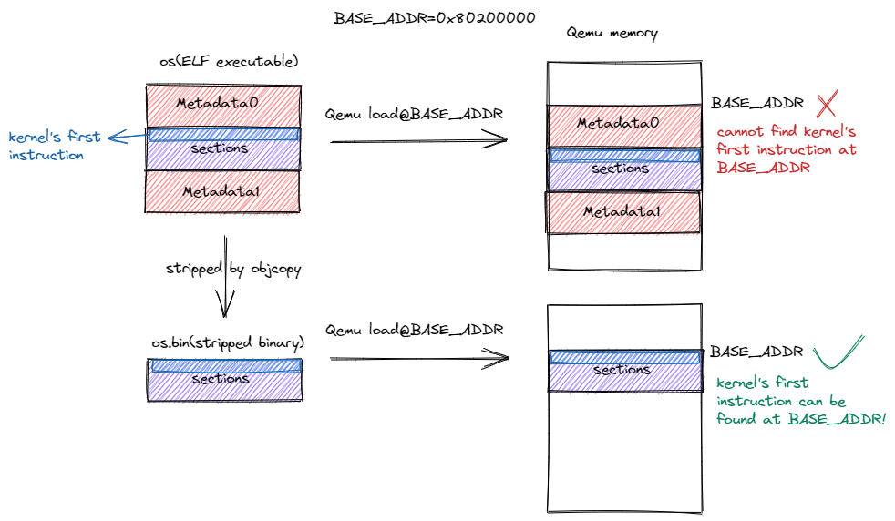

[Qemu 模拟器](http://rcore-os.cn/rCore-Tutorial-Book-v3/chapter1/3first-instruction-in-kernel1.html#:~:text=%E5%A6%82%E4%B8%8B%E5%91%BD%E4%BB%A4%E6%9D%A5-,%E5%90%AF%E5%8A%A8%20Qemu%20%E5%B9%B6%E8%BF%90%E8%A1%8C%E6%88%91%E4%BB%AC%E7%9A%84%E5%86%85%E6%A0%B8,-%EF%BC%9A)

[‘virt’ Generic Virtual Platform (virt)](https://www.qemu.org/docs/master/system/riscv/virt.html)

```
qemu-system-riscv64 \
    -machine virt \
    -nographic \
    -bios ../bootloader/rustsbi-qemu.bin \
    -device loader,file=target/riscv64gc-unknown-none-elf/release/os.bin,addr=0x80200000
	-s -S
```

- `-machine virt` 表示将模拟的 64 位 RISC-V 计算机设置为名为 `virt` 的虚拟计算机。我们知道，即使同属同一种指令集架构，也会有很多种不同的计算机配置，比如 CPU 的生产厂商和型号不同，支持的 I/O 外设种类也不同。关于 `virt` 平台的更多信息可以参考 [1](http://rcore-os.cn/rCore-Tutorial-Book-v3/chapter1/3first-instruction-in-kernel1.html#virt-platform) 。Qemu 还支持模拟其他 RISC-V 计算机，其中包括由 SiFive 公司生产的著名的 HiFive Unleashed 开发板。
- `-nographic` 表示模拟器不需要提供图形界面，而只需要对外输出字符流。
- 通过 `-bios` 可以设置 Qemu 模拟器开机时用来初始化的引导加载程序（bootloader），这里我们使用预编译好的 `rustsbi-qemu.bin` ，它需要被放在与 `os` 同级的 `bootloader` 目录下，该目录可以从每一章的代码分支中获得。
- 通过虚拟设备 `-device` 中的 `loader` 属性可以在 Qemu 模拟器开机之前将一个宿主机上的文件载入到 Qemu 的物理内存的指定位置中， `file` 和 `addr` 属性分别可以设置待载入文件的路径以及将文件载入到的 Qemu 物理内存上的物理地址。注意这里我们载入的文件带有 `.bin` 后缀，它并不是上一节中我们移除标准库依赖后构建得到的内核可执行文件，而是还要进行加工处理得到内核镜像。

- `-s` 可以使 [Qemu 监听本地 TCP 端口](http://rcore-os.cn/rCore-Tutorial-Book-v3/chapter1/4first-instruction-in-kernel2.html#:~:text=%E5%8F%AF%E4%BB%A5%E4%BD%BF%20Qemu%20%E7%9B%91%E5%90%AC%E6%9C%AC%E5%9C%B0%20TCP%20%E7%AB%AF%E5%8F%A3%201234%20%E7%AD%89%E5%BE%85%20GDB%20%E5%AE%A2%E6%88%B7%E7%AB%AF%E8%BF%9E%E6%8E%A5) 1234 等待 GDB 客户端连接，而 `-S` 可以使 Qemu 在收到 GDB 的请求后再开始运行。因此，Qemu 暂时没有任何输出。注意，如果不想通过 GDB 对于 Qemu 进行调试而是直接运行 Qemu 的话，则要删掉最后一行的 `-s -S` 。


[Qemu 启动流程](http://rcore-os.cn/rCore-Tutorial-Book-v3/chapter1/3first-instruction-in-kernel1.html#:~:text=%E8%BF%9B%E8%A1%8C%E6%B7%B1%E5%85%A5%E8%AE%A8%E8%AE%BA%E3%80%82-,Qemu%20%E5%90%AF%E5%8A%A8%E6%B5%81%E7%A8%8B,-%23)

-  Qemu 的第一阶段固定跳转到 `0x80000000`
<<<<<<< HEAD
- 第二阶段的 bootloader `rustsbi-qemu.bin` 放在以物理地址 `0x80000000` 开头的物理内存中，这样就能保证 `0x80000000` 处正好保存 bootloader 的第一条指令
- 对于不同的 bootloader 而言，下一阶段软件的入口不一定相同，而且获取这一信息的方式和时间点也不同：入口地址可能是一个预先约定好的固定的值，也有可能是在 bootloader 运行期间才动态获取到的值
=======
-  第二阶段的 bootloader `rustsbi-qemu.bin` 放在以物理地址 `0x80000000` 开头的物理内存中，这样就能保证 `0x80000000` 处正好保存 bootloader 的第一条指令
-  对于不同的 bootloader 而言，下一阶段软件的入口不一定相同，而且获取这一信息的方式和时间点也不同：入口地址可能是一个预先约定好的固定的值，也有可能是在 bootloader 运行期间才动态获取到的值
>>>>>>> 53097e6ba2d0ed48c69ed6afd6b38332f553eced
  - RustSBI 是将下一阶段的入口地址预先约定为固定的 `0x80200000` ，在 RustSBI 的初始化工作完成之后，它会跳转到该地址并将计算机控制权移交给下一阶段的软件——内核镜像
-  第三阶段为了正确地和上一阶段的 RustSBI 对接，我们需要保证内核的第一条指令位于物理地址 `0x80200000` 处。为此，我们需要将内核镜像预先加载到 Qemu 物理内存以地址 `0x80200000` 开头的区域上。一旦 CPU 开始执行内核的第一条指令，证明计算机的控制权已经被移交给我们的内核


如何得到一个能够在 Qemu 上成功运行的内核镜像呢？

> 首先我们需要通过链接脚本调整内核可执行文件的内存布局，使得内核被执行的第一条指令位于地址 `0x80200000` 处，同时代码段所在的地址应低于其他段。这是因为 Qemu 物理内存中低于 `0x80200000` 的区域并未分配给内核，而是主要由 RustSBI 使用。

此时得到的内核可执行文件完全符合我们对于内存布局的要求，但是我们不能将其直接提交给 Qemu ，因为它除了实际会被用到的代码和数据段之外还有一些多余的元数据，这些元数据无法yun x被 Qemu 在加载文件时利用，且会使代码和数据段被加载到错误的位置



- 红色的区域表示内核可执行文件中的元数据

- 深蓝色的区域表示各个段（包括代码段和数据段）(linker.ld session)
- 浅蓝色区域则表示内核被执行的第一条指令，它位于深蓝色区域的开头

图示的上半部分中，我们直接将内核可执行文件 `os` 加载到 Qemu 内存的 `0x80200000` 处，由于内核可执行文件的开头是一段元数据，这会导致 Qemu 内存 `0x80200000` 处无法找到内核第一条指令，也就意味着 RustSBI 无法正常将计算机控制权转交给内核。相反，图示的下半部分中，将元数据丢弃得到的内核镜像 `os.bin` 被加载到 Qemu 之后，则可以在 `0x80200000` 处正确找到内核第一条指令。

> 其次，我们需要将内核可执行文件中的元数据丢掉得到内核镜像，此内核镜像仅包含实际会用到的代码和数据。这则是因为 Qemu 的加载功能过于简单直接，它直接将输入的文件逐字节拷贝到物理内存中，因此也可以说这一步是我们在帮助 Qemu 手动将可执行文件加载到物理内存中。
>
> 元数据：为描述数据的数据（data about data），主要是描述数据属性（property）的信息，内存地址并不需要
>
> 这些元数据能够帮助我们更加灵活地加载并使用可执行文件，比如在加载时完成一些重定位工作或者动态链接。不过由于 Qemu 的加载功能过于简单，我们只能将这些元数据丢弃再交给 Qemu 。从某种意义上可以理解为我们手动帮助 Qemu 完成了可执行文件的加载。


[调整内核的内存布局](http://rcore-os.cn/rCore-Tutorial-Book-v3/chapter1/4first-instruction-in-kernel2.html#:~:text=%E5%BA%93%20core%20%E4%B8%AD%E3%80%82-,%E8%B0%83%E6%95%B4%E5%86%85%E6%A0%B8%E7%9A%84%E5%86%85%E5%AD%98%E5%B8%83%E5%B1%80%23,-%E7%94%B1%E4%BA%8E%E9%93%BE%E6%8E%A5)

由于链接器默认的内存布局并不能符合我们的要求，实现与 Qemu 的正确对接，我们可以通过 **链接脚本** (Linker Script) 调整链接器的行为，使得最终生成的可执行文件的内存布局符合我们的预期。


[0x80200000 可否改为其他地址？](http://rcore-os.cn/rCore-Tutorial-Book-v3/chapter1/4first-instruction-in-kernel2.html#:~:text=0x80200000%20%E5%8F%AF%E5%90%A6%E6%94%B9%E4%B8%BA%E5%85%B6%E4%BB%96%E5%9C%B0%E5%9D%80%EF%BC%9F)

> 内核并不是位置无关的，所以我们必须将内存布局的起始地址设置为 `0x80200000` ，与之匹配我们也必须将内核加载到这一地址

[静态链接与动态链接](http://rcore-os.cn/rCore-Tutorial-Book-v3/chapter1/4first-instruction-in-kernel2.html#:~:text=%E6%B3%A8%E8%A7%A3-,%E9%9D%99%E6%80%81%E9%93%BE%E6%8E%A5%E4%B8%8E%E5%8A%A8%E6%80%81%E9%93%BE%E6%8E%A5,-%E9%9D%99%E6%80%81%E9%93%BE%E6%8E%A5)

> Qemu 不支持在加载时动态链接，因此内核采用静态链接进行编译


```
rust-objcopy --strip-all target/riscv64gc-unknown-none-elf/release/os -O binary target/riscv64gc-unknown-none-elf/release/os.bin
```


```
riscv64-unknown-elf-gdb \
    -ex 'file target/riscv64gc-unknown-none-elf/release/os' \
    -ex 'set arch riscv:rv64' \
    -ex 'target remote localhost:1234'
```


```
(gdb) x/10i $pc
=> 0x1000:  auipc   t0,0x0
0x1004:     addi    a1,t0,32
0x1008:     csrr    a0,mhartid
0x100c:     ld      t0,24(t0)
0x1010:     jr      t0
0x1014:     unimp
0x1016:     unimp
0x1018:     unimp
0x101a:     0x8000
0x101c:     unimp
```

这里 `x/10i $pc` 的含义是从当前 PC 值的位置开始，在内存中反汇编 10 条指令。

当数据为 0 的时候则会被反汇编为 `unimp` 指令

```
(gdb) si
```

`si` 可以让 Qemu 每次向下执行一条指令，之后屏幕会打印出待执行的下一条指令的地址

```
(gdb) si
0x0000000000001004 in ?? ()
(gdb) si
0x0000000000001008 in ?? ()
(gdb) si
0x000000000000100c in ?? ()
(gdb) si
0x0000000000001010 in ?? ()
(gdb) p/x $t0
1 = 0x80000000
```

 `p/x $t0` 以 16 进制打印寄存器 `t0` 的值，注意当我们要打印寄存器的时候需要在寄存器的名字前面加上 `$` 

当位于 `0x1010` 的指令执行完毕后，下一条待执行的指令位于 RustSBI 的入口，也即 `0x80000000` ，这意味着我们即将把控制权转交给 RustSBI 


检查控制权能否被移交给我们的内核

> 为了将控制权转交给使用 Rust 语言编写的内核入口，确实需要手写若干行汇编代码

```
(gdb) b *0x80200000
Breakpoint 1 at 0x80200000
(gdb) c
Continuing.

Breakpoint 1, 0x0000000080200000 in ?? ()
```

在内核的入口点，也即地址 `0x80200000` 处打一个断点。需要注意，当需要在一个特定的地址打断点时，需要在地址前面加上 `*` 。接下来通过 `c` 命令（Continue 的缩写）让 Qemu 向下运行直到遇到一个断点。


运行(看Makefile)

```
qemu-system-riscv64 \
    -machine virt \
    -nographic \
    -bios ../bootloader/rustsbi-qemu.bin \
    -device loader,file=target/riscv64gc-unknown-none-elf/release/os.bin,addr=0x80200000
```


**Qemu 的用户态模拟和系统级模拟**

Qemu 有两种运行模式：用户态模拟（User mode）和系统级模拟（System mode）。

在 RISC-V 架构中，用户态模拟可使用 `qemu-riscv64` 模拟器，它可以模拟一台预装了 Linux 操作系统的 RISC-V 计算机。

但是一般情况下我们并不通过输入命令来与之交互（就像我们正常使用 Linux 操作系统一样），它仅支持载入并执行单个可执行文件。具体来说，它可以解析基于 RISC-V 的应用级 ELF 可执行文件，加载到内存并跳转到入口点开始执行。

在翻译并执行指令时，如果碰到是系统调用相关的汇编指令，它会把不同处理器（如 RISC-V）的 Linux 系统调用转换为本机处理器（如 x86-64）上的 Linux 系统调用，这样就可以让本机 Linux 完成系统调用，并返回结果（再转换成 RISC-V 能识别的数据）给这些应用。

相对的，我们使用 `qemu-system-riscv64` 模拟器来系统级模拟一台 RISC-V 64 裸机，它包含处理器、内存及其他外部设备，支持运行完整的操作系统。


---

**模拟器与真机的不同之处**

至少在 Qemu 模拟器的默认配置下，各类缓存如 i-cache/d-cache/TLB 都处于机制不完全甚至完全不存在的状态。目前在 Qemu 平台上，即使我们不加上刷新 i-cache 的指令，大概率也是能够正常运行的。但在 K210 物理计算机上，如果没有执行汇编指令 `fence.i` ，就会产生由于指令缓存的内容与对应内存中指令不一致导致的错误异常。


---

> [gdb riscv](https://www.cnblogs.com/DF11G/p/16553404.html)
>
> [调试汇编](https://zhuanlan.zhihu.com/p/259625135) (看后半部分)

**Qemu 的用户态模拟和系统级模拟**

Qemu 有两种运行模式：用户态模拟（User mode）和系统级模拟（System mode）。

在 RISC-V 架构中，用户态模拟可使用 `qemu-riscv64` 模拟器，它可以模拟一台预装了 Linux 操作系统的 RISC-V 计算机。

但是一般情况下我们并不通过输入命令来与之交互（就像我们正常使用 Linux 操作系统一样），它仅支持载入并执行单个可执行文件。具体来说，它可以解析基于 RISC-V 的应用级 ELF 可执行文件，加载到内存并跳转到入口点开始执行。

在翻译并执行指令时，如果碰到是系统调用相关的汇编指令，它会把不同处理器（如 RISC-V）的 Linux 系统调用转换为本机处理器（如 x86-64）上的 Linux 系统调用，这样就可以让本机 Linux 完成系统调用，并返回结果（再转换成 RISC-V 能识别的数据）给这些应用。

相对的，我们使用 `qemu-system-riscv64` 模拟器来系统级模拟一台 RISC-V 64 裸机，它包含处理器、内存及其他外部设备，支持运行完整的操作系统。


---

**模拟器与真机的不同之处**

至少在 Qemu 模拟器的默认配置下，各类缓存如 i-cache/d-cache/TLB 都处于机制不完全甚至完全不存在的状态。目前在 Qemu 平台上，即使我们不加上刷新 i-cache 的指令，大概率也是能够正常运行的。但在 K210 物理计算机上，如果没有执行汇编指令 `fence.i` ，就会产生由于指令缓存的内容与对应内存中指令不一致导致的错误异常。
