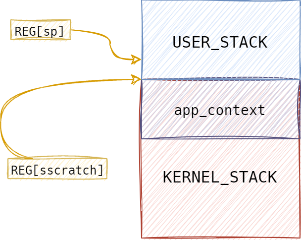
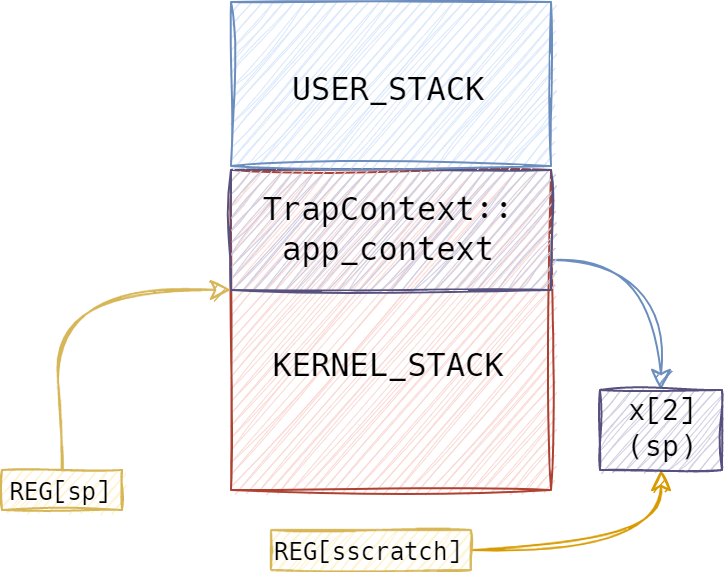
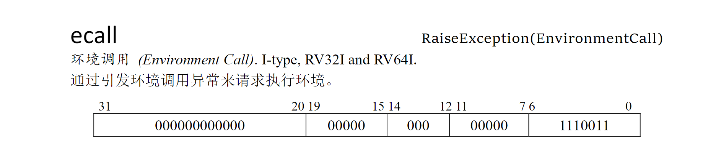

# 批处理操作系统——特权级切换

## 系统调用

我们讨论操作系统（rcore-os2）的特权级切换。目前我们实现的批处理系统的系统调用主要有两个：sys_write 与 sys_exit。特权级切换主要发生在调用 sys_write 时。

> 我们先来简单看看应用程序中 sys_write 是如何进行的：
>
> print/println宏 -> crate::console::print -> Stdout::write_fmt -> crate::console::write_str -> crate::lib::write -> crate::syscall::sys_write

总之，应用程序使用我们自己实现的 print/println 宏时，会调用sys_write。

```rust
// user/src/lib.rs
pub fn write(fd: usize, buf: &[u8]) -> isize {
    sys_write(fd, buf)
}

// user/src/syscall.rs
pub fn sys_write(fd: usize, buf: &[u8]) -> isize {
    syscall(SYSCALL_WRITE, [fd, buf.as_ptr() as usize, buf.len()])
}

// user/src/syscall.rs
pub fn syscall(id: usize, args: [usize; 3]) -> isize {
    let mut ret: isize;
    unsafe {
        core::arch::asm!( // asm! 宏可以将汇编代码嵌入到局部的函数上下文中
            "ecall", // `ecall` 指令触发 Trap
            inlateout ("x10") args[0] => ret, // `a0` 保存系统调用的返回值
            // 输入参数 args[1] 绑定到 ecall 的输入寄存器 x11 即 a1 中，
            // 编译器自动插入相关指令并保证在 ecall 指令被执行之前寄存器 a1 的值与 args[1] 相同
            in ("x11") args[1], //  `a0~a6` 保存系统调用的参数
            in ("x12") args[2],
            in ("x17") id, // `a7` 用来传递 syscall ID
        );
    }
    ret
}
```

我们可以看到，当进程退出时，使用将寄存器 a7 传递了系统调用号，使用 a0 保存系统调用的返回值。

那么应用程序究竟如何与操作系统建立联系的呢？没错，就是系统调用。接下来我们回到操作系统上。


## 进程上下文的保存与恢复

```rust
// os/src/syscall/mod.rs
pub fn syscall(syscall_id: usize, args: [usize; 3]) -> isize {
    match syscall_id {
        SYSCALL_WRITE => sys_write(args[0], args[1] as *const u8, args[2]),
        SYSCALL_EXIT => sys_exit(args[0] as i32),
        _ => panic!("Unknown syscall: {}", syscall_id),
    }
}
```

这里我们将应用程序的发出的系统调用与操作系统提供的系统调用联系起来。

> os 下的 sys_write 与 user 下的 sys_write 实现差不多。
>
> *疑问*：use 的 syscall 与 os 的 sbi_call 实现基本一模一样；user 调用了一次 ecall，os 同样也是调用了一次 ecall，这也意味着os 进入 m 模式完成 sys_write 吗？
>
> 是的，所有陷入都会进入 m 态，但 m 态可以选择不处理，也可以把它代理给 s 态，让 sbi 处理。

那么，应用程序发出的系统调用究竟 *何时* 与 操作系统提供的系统调用联系起来的呢？

```rust
// os/src/trap/mod.rs

pub fn trap_handler(cx: &mut TrapContext) -> &mut TrapContext {
 Trap::Exception(Exception::UserEnvCall) => {
            // 在 __restore 的时候 sepc 在恢复之后就会指向 ecall 的下一条指令，并在 sret 之后从那里开始执行。
            cx.sepc += 4;
            cx.x[10] = syscall(cx.x[17], [cx.x[10], cx.x[11], cx.x[12]]) as usize; // x10(a0) 保存返回值，这里系统调用的返回值，保存在用户的上下文的寄存器 x10(a0) 中
        }
    }
    cx // 最后的返回值与传入的参数均为 cx，故 寄存器 a0 值不变
}
```

在往上看，发现实际是通过 `trap_handler` 来联系的。接下来，我们稍微详细的聊聊究竟是怎样进行进程切换的。

> 这里还需要额外补充一点点 risc-v 的知识：
>
> 我们看到进程发起系统调用时，在 syscall 中嵌入了一行 ecall 指令。执行 `ecall` 指令会触发 Trap，也就是我们的 trap_handler 这部分。
>
> 在 RISC-V 调用规范中，和函数调用的 ABI 情形类似，约定寄存器 `a0~a6` 保存系统调用的参数， `a0` 保存系统调用的返回值。所有的 syscall 都是通过 `ecall` 指令触发的，除了各输入参数之外我们还额外需要一个寄存器来保存要请求哪个系统调用，寄存器 `a7` 就是用来传递这个 syscall ID 的。
>
> 当 CPU 执行 `ecall` 并准备从用户特权级 陷入（ `Trap` ）到 S 特权级的时候，硬件会自动完成如下这些事情：
>
> - `sstatus` 的 `SPP` 字段会被修改为 CPU 当前的特权级（U/S）；
> - `sepc` 会被修改为 Trap 处理完成后默认会执行的下一条指令的地址；
> - `scause/stval` 分别会被修改成这次 Trap 的原因以及相关的附加信息；
> - CPU 会跳转到 `stvec` 所设置的 Trap 处理入口地址，并将当前特权级设置为 S ，然后从Trap 处理入口地址处开始执行。
>
> 在这里，我们需要关注一下 `stvec`，在 RV64 中， `stvec` 是一个 64 位的 CSR，在中断使能的情况下，保存了中断处理的入口地址。

我们在 os/src/trap/mod.rs 的 `init()` 函数中，保存了中断向量 -> 中断处理程序的入口地址。如图：


### 保存进程上下文

接下来让我们详细看看 `__alltraps`

```assembly
__alltraps:
    # 交换 sscratch 和 sp 的值
    csrrw sp, sscratch, sp

    # 内核栈分配
    addi sp, sp, -34*8
    # skip x0, x0 被硬编码为 0
    sd x1, 1*8(sp)
    # skip sp(x2), 即 sp, 需要使用 sp2 来找到每个寄存器应该被保存到的正确的位置, 之后保存
    sd x3, 3*8(sp)
    # skip tp(x4), 并不会使用到
    # 按照 TrapContext 结构体的内存布局，基于内核栈的位置（sp所指地址）来从低地址到高地址分别按顺序放置 x0~x31这些通用寄存器
    .set n, 5
    .rept 27
        SAVE_GP %n
        .set n, n+1
    .endr

    # 指令 csrr rd, csr 的功能就是将 CSR 的值读到寄存器 rd 中。
    # 这里我们不用担心 t0(x5) 和 t1(x6) 被覆盖，因为它们刚刚已经被保存了
    csrr t0, sstatus
    csrr t1, sepc

    sd t0, 32*8(sp)   # sstatus
    sd t1, 33*8(sp)   # sepc
    csrr t2, sscratch # 将 sscratch 的值读到寄存器 t2
    sd t2, 2*8(sp)    # 保存到内核栈上
    # 注意： sscratch 的值是进入 Trap 之前的 sp 的值，指向用户栈。而现在的 sp 则指向内核栈。
    mv a0, sp # 寄存器 a0 指向内核栈的栈顶 sp
    call trap_handler
```

进入 S 特权级的 Trap 处理之前，必须保存原控制流的寄存器状态，这一般通过内核栈来保存。

- 首先通过 alltraps 将 Trap 上下文保存在内核栈上；

- 然后跳转到使用 Rust 编写的 trap_handler 函数完成 Trap 分发及处理；
- 当 trap_handler 返回之后，使用 restore 从保存在内核栈上的 Trap 上下文恢复寄存器；
- 最后通过一条 sret 指令回到应用程序执行。

让我们来分析 + 图解几个比较关键的代码部分：

- 首先在执行 `__alltraps` 之前，寄存器 sp 执行用户栈某处，sscratch 指向 `KERNERL_STACK`栈顶。这里 sscratch 为什么指向的这个位置我们暂且 *按下不表*，我们会在下一章，应用程序切换的分析时，看到为什么是这样的:)

  

- `csrrw sp, sscratch, sp`：交换 sscratch 和 sp 的值;

  `addi sp, sp, -34*8`：RISC-V 架构中，栈是从高地址向低地址增长的，因此这里先减去 `TrapContext` 的大小，然后将 sp 指向这个位置，以进行内核栈分配。

  > 寄存器 sp 指向内核栈并分配了一块空间，这块空间的大小实际就是保存的上下文大小
  >
  > ```rust
  > // os/src/trap/context.rs
  > 
  > # [repr(C)] // C 内存布局
  > // size = 34 * 8 Bytes -> see trap.S
  > pub struct TrapContext {
  >     pub x: [usize; 32],
  >     pub sstatus: Sstatus,
  >     pub sepc: usize,
  > }
  > ```

  

  > 注意：此时寄存器 sscratch 保存了应用程序发起系统调用(异常)前，寄存器 sp 保存的值。

- 接下来依次保存相关寄存器。

- `csrr t2, sscratch` 与 `sd t2, 2*8(sp)`：将 sscratch 的值保存在内核栈上（即cx.x[2]）

  

  前面提到，此时 sscracth 保存的值为发起系统调用前，寄存器 sp 保存的值。

- `mv a0, sp `：寄存器 a0 指向内核栈的栈顶 sp。

  - 让寄存器 a0 指向内核栈的栈指针也就是我们刚刚保存的 Trap 上下文的地址，这是由于我们接下来要调用 `trap_handler` 进行 Trap 处理，它的第一个参数 cx 由调用规范要从 a0 中获取。

    这里就与我们前面讲的：“应用程序发出的系统调用究竟 *何时* 与 操作系统提供的系统调用联系起来的呢？”联系起来。

    > 善用 ctrl + f 查找哦 :)

  - Trap 处理函数 trap_handler 需要 Trap 上下文的原因在于：它需要知道其中某些寄存器的值，比如在系统调用的时候应用程序传过来的 syscall ID 和对应参数。我们不能直接使用这些寄存器现在的值，因为它们可能已经被修改了，因此要去内核栈上找已经被保存下来的值。

- `call trap_handler`：转移到 `trap_handler`函数

  - ```rust
    pub fn trap_handler(cx: &mut TrapContext) -> &mut TrapContext {
    	...
        cx // 最后的返回值与传入的参数均为 cx，故寄存器 a0 值不变
    }
    ```

  - 根据RISC-V调用规范，a0 既是保存函数第一个参数的寄存器，也是保存函数返回值的寄存器，而 `trap_handler` 的参数为 cx，返回值同样也是cx（请查看函数），故 `call trap_handler` 前后，寄存器 a0 的值不变。

    >注意，`call trap_handler` 前后，寄存器 a0 的值不变。
    >
    >你可能会有疑惑：
    >
    >```rust
    >cx.x[10] = syscall(cx.x[17], [cx.x[10], cx.x[11], cx.x[12]]) as usize;
    >```
    >
    >这里cx.x[10] 不就是寄存器 a0 吗？为什么说 trap_handler 之后寄存器 a0 的值不变？
    >
    >其实，在修改 cx.x[10] 时，a0 确实被修改为 syscall 的返回值，保存在用户的上下文的寄存器 x10(a0) 中；但是最后返回时，寄存器 a0 再次被修改回 cx 的地址，即最后的返回值与传入的参数均为 cx，故寄存器 a0 值不变。


### 恢复进程上下文

再简单梳理一下，应用进程发起系统调用：

发起系统调用 syscall -> 执行 ecall 指令 -> 陷入trap，并通过 stvec 寄存器找到中断处理程序 __alltraps -> 保存进程上下文后，调用 trap_handler 函数 -> 执行相应的系统调用

那么，让我们来看看这个 `__restore` 函数是如何实现的。

```assembly
__restore:
    # case1: start running app by __restore
    # case2: back to U after handling trap
    mv sp, a0 # 传入参数a0: 内核栈中保存的用户上下文

    # 从内核栈顶的 Trap 上下文恢复通用寄存器和 CSR 
    # restore sstatus/sepc
    ld t0, 32*8(sp)  # sstatus
    ld t1, 33*8(sp)  # sepc
    ld t2, 2*8(sp)   # sscratch; x2(sp) 指向 USER_STACK 栈顶
    csrw sstatus, t0
    csrw sepc, t1
    csrw sscratch, t2
    # restore general-purpuse registers except sp/tp
    ld x1, 1*8(sp)
    ld x3, 3*8(sp)
    .set n, 5
    .rept 27
        LOAD_GP %n
        .set n, n+1
    .endr

    # 在内核栈上回收 Trap 上下文所占用的内存
    addi sp, sp, 34*8

    # 交换 sscratch 和 sp
    csrrw sp, sscratch, sp

    # 回到 U 模式
    sret
```

你可能好奇，这里 `__restore` 为什么给出了两个 case，我们这里先讨论 case 2，也就是返回用户态的情况，case 1 我们将在下一章见到。

- 先说明一下 `__restore` 函数的声明： `fn __restore(cx_addr: usize);` 

  该函数的参数 cx_addr 由 a0 寄存器保存，在 `call trap_handler` 之后，执行 `__restore` 之前，寄存器a0保存的值不变，均为 KERNEL_STACK 中用户上下文的地址。

  

- `mv sp, a0`：将 a0 的值给 寄存器 sp，使sp 指向 KERNERL_STACK 中，用户上下文的底部

  

- `ld t2, 2*8(sp)`：x2(sp) 指向 USER_STACK 栈

  `csrw sscratch, t2`：将用户上下文 x[2] 保存的值赋值给 sscrach

  

- 从内核栈的上下文中，恢复相关寄存器的值。

- `addi sp, sp, 34*8`：内核栈上回收 Trap 上下文所占用的内存，回归进入 Trap 之前的内核栈栈顶。

  

- `csrrw sp, sscratch, sp`：再次交换 sscratch 和 sp，现在 sp 重新指向USER_STACK中，
  sscratch 也依然保存进入 Trap 之前的状态，并指向内核栈栈顶。

  

- `sret`：在应用程序控制流状态被还原之后，使用 sret 指令回到 U 特权级继续运行应用程序控制流。

当我们回到用户态时，由于在进行特权级切换的系统调用之前，也就是在 `trap_handler` 中执行了 `cx.sepc += 4;` 也就是将内核栈中保存的用户上下文的 sepc 寄存器的值修改为下一条指令。

> *疑问*：为什么是 +4 而不是 +8 ？我们实现的不是 64 位 os 吗？
>
> 查看 risc-v 实际是有 32 位 与 64 位 的 ecall 指令的：
>
> 
>
> 这里需要区分一下：riscv 指令长度只有 2 种，压缩的 16 位，不压缩的 32 位，与地址宽度无关；risc-v 64 是指地址宽度 64 位，寄存器宽度 64 位，但指令还是 32 位

