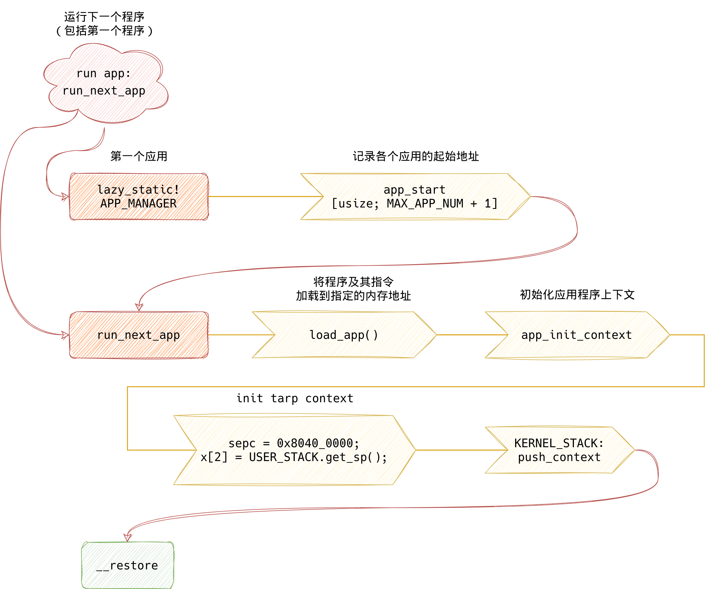

# 批处理操作系统——进程切换

对于本章的内容，首先我想提两个问题：

1. 第一个进程是如何加载的？
2. 如何加载下一个程序？或者说进程是如何切换的？

## 将应用程序链接到内核

目前，我们的应用程序编译好后，需要链接到内核，让内核来管理程序的运行。在 `os/src/main.rs` 中能够找到这样一行:

```rust
global_asm!(include_str!("link_app.S"));
```

这里我们引入了一段汇编代码 `link_app.S` ，它一开始并不存在，而是在构建操作系统时，使用 [os/build.rs](https://github.com/chyyuu/os_kernel_lab/blob/ch2-dev/os/build.rs) 脚本自动生成的:

[os/build.rs](https://github.com/chyyuu/os_kernel_lab/blob/ch2-dev/os/build.rs):

```rust
    writeln!(f, r#"
    .align 3
    .section .data
    .global _num_app
_num_app:
    .quad {}"#, apps.len())?;
```

我们使用这个汇编文件，将应用程序链接到内核。

我们可以看到，在此处，我们将应用程序加载到 `.data` 段。另外标记了一个全局符号：`_num_app`。

[os/build.rs](https://github.com/chyyuu/os_kernel_lab/blob/ch2-dev/os/build.rs#:~:text=(f%2C%20r%23%22-,.section%20.data,app_%7B0%7D_end%3A%22%23%2C%20idx%2C%20app%2C%20TARGET_PATH)%3F%3B,-%7D)

```rust
 for (idx, app) in apps.iter().enumerate() {
        println!("app_{}: {}", idx, app);
        writeln!(f, r#"
    .section .data
    .global app_{0}_start
    .global app_{0}_end
app_{0}_start:
    .incbin "{2}{1}.bin"
app_{0}_end:"#, idx, app, TARGET_PATH)?;
    }
```

我们分别标记来各个应用程序在内存的起始与终止位置，这些 `.global` 标记的符号将帮助我们获取各个应用程序在内存中的地址。

在 [os/batch.rs](https://github.com/chyyuu/os_kernel_lab/blob/ch2-dev/os/src/batch.rs#:~:text=%7D-,lazy_static!%20%7B,%7D,-pub%20fn%20init) 中，我们可以看到

```rust
lazy_static! {
    static ref APP_MANAGER: UnSafeCell<AppManager> = unsafe {
        UnSafeCell::new({
            extern "C" {
                fn _num_apps();
            }
            let num_app_ptr = _num_apps as usize as *const usize; // 记录应用数量的指针/地址
            let num_apps = num_app_ptr.read_volatile(); // read_volatile：对ptr的值进行易失性读取，而无需移动它；直接存取原始内存地址，可以防止编译器对代码优化
            let mut app_start: [usize; MAX_APP_NUM + 1] = [0; MAX_APP_NUM + 1];
            // slice::from_raw_parts 根据指针和长度形成切片
            let app_start_raw: &[usize] = core::slice::from_raw_parts(
                // why add 1 -> see build.rs: add 1 get the first app start location
                num_app_ptr.add(1), num_apps + 1
            );
            
         	app_start[..=num_apps].copy_from_slice(app_start_raw);
          	AppManager {
                num_apps,
                current_app: 0,
                app_start,
            }
        })
    };
}
```

这里初始化 `APP_MANAGER` 时找到 `link_app.S` 中提供的符号 `_num_app` ，并从这里开始解析出 **应用数量** 以及各个应用的 **起始地址**：

`link_app.S`:

```assembly
_num_apps:
    .quad 7
    .quad app_0_start
    .quad app_1_start
    .quad app_2_start
    .quad app_3_start
    .quad app_4_start
    .quad app_5_start
    .quad app_6_start
    .quad app_6_end
```

在此处，我们将应用程序加载到 `.data` 段，如图所示：


## 加载第一个应用程序

### 第一个应用程序是如何加载的呢？

我们在 [os/src/main.rs](https://github.com/chyyuu/os_kernel_lab/blob/ch2-dev/os/src/main.rs#:~:text=batch%3A%3Arun_next_app()%3B) 中看见：

```rust
batch::init();
batch::run_next_app(); // 运行第一个应用程序
```

[os/src/batch.rs](https://github.com/chyyuu/os_kernel_lab/blob/ch2-dev/os/src/batch.rs#:~:text=pub%20fn%20run_next_app()%20%2D%3E%20!%20%7B)

```rust
pub fn run_next_app() -> ! {
	...
    extern "C" {
        fn __restore(cx_addr: usize); // see trap.S
    }
    unsafe {
        // 在内核栈上压入一个 Trap 上下文;
        // push_context 的返回值是内核栈压入 Trap 上下文之后的栈顶，它会被作为 __restore 的参数,
        // 这使得在 __restore 函数中 sp 仍然可以指向内核栈的栈顶
        __restore(KERNEL_STACK.push_context(TrapContext::app_init_context(
            APP_BASE_ADDRESS, // Trap 上下文的 sepc 是应用程序入口地址 0x80400000;
            USER_STACK.get_sp(), // sp 寄存器指向用户栈, 用户栈栈顶作为 cx.x[2] 的初始值
        )) as *const _ as usize);
    }
    panic!("Unreachable in batch::run_next_app!");
}

pub fn push_context(&self, cx: TrapContext) -> &'static mut TrapContext {
    let cx_ptr = (self.get_sp() - core::mem::size_of::<TrapContext>()) as *mut TrapContext; // get the address of TrapContext；内核栈分配一块空间给保存应用程序上下文
    unsafe {
        *cx_ptr = cx;
    }
    unsafe { cx_ptr.as_mut().unwrap() }
}
```

[os/src/tarp/context.rs](https://github.com/chyyuu/os_kernel_lab/blob/ch2-dev/os/src/trap/context.rs#:~:text=pub%20fn%20app_init_context(entry%3A%20usize%2C%20sp%3A%20usize)%20%2D%3E%20Self%20%7B)

```rust
pub fn app_init_context(entry: usize, sp: usize) -> Self {
	...
    // 修改 sepc 寄存器为应用程序入口点 entry(APP_BASE_ADDRESS)，
    // sp 寄存器为我们设定的一个栈指针，并将 sstatus 寄存器的 SPP 字段设置为 User
    let mut context = Self {
        x: [0; 32],
        sepc: entry, // APP_BASE_ADDRESS: 0x80400000
        sstatus,
    };
    context.set_sp(sp); // 设置x[2]，指向用户栈栈顶
    context
}

pub fn set_sp(&mut self, sp: usize) {
    self.x[2] = sp; // x[2] is sp
}
```

如图所示：



### restore 函数的第二个应用

> 我们发现，这里居然调用了 `__restore`，上一章中，我们说这个函数是用于恢复进程上下文的，但为什么这里再一次用到了呢？其实看 `__restore` 代码，可以发现这里的注释：
>
> ```
> __restore:
>  # case1: start running app by __restore
>  # case2: back to U after handling trap
> ```
>
> 没错我们现在来讨论 case 1 的情况：开始运行应用程序。

在 [run_next_app](https://github.com/chyyuu/os_kernel_lab/blob/ch2-dev/os/src/batch.rs#:~:text=pub%20fn%20run_next_app()%20%2D%3E%20!%20%7B) 中：

```rust
    unsafe {
        // 在内核栈上压入一个 Trap 上下文; 在 __restore 函数中 sp 指向内核栈的栈顶
        __restore(KERNEL_STACK.push_context(TrapContext::app_init_context(
            APP_BASE_ADDRESS,
            USER_STACK.get_sp(),
        )) as *const _ as usize);
    }
```

引入 `__restore` 函数，在内核栈上压入一个 Trap 上下文，该上下文是一块通过 `app_init_context()` 新建的一块上下文：

- 其 sepc 是应用程序入口地址 0x80400000；

- 其 sp 寄存器指向用户栈(见`set_sp`)，其 sstatus 的 SPP 字段被设置为 User ；

  > *注意* 这里将sp 寄存器指向用户栈栈顶

- push_context 的返回值是内核栈压入 Trap 上下文之后的栈顶，它会被作为 `__restore` 的参数 cx_addr，参数由 a0 寄存器保存，此时 a0 指向新构建的用户上下文。

  > **注意**
  >
  > 此时 a0 寄存器指向的是一块新的上下文，我们前面提到过 ”现在我们是在进行进程切换，a0 寄存器的值虽然也没有修改，但是上下文其实已经被修改了“。
  >
  > 我们还提到过 ”为什么只关注最后两条指令，这里先 *按下不表*“，这是因为，虽然我们进行了上下文保存，但实际上我们需要进行进程的切换，所以下一新进程并不需要知道上一进程的上下文。我们新建并初始化了一块上下文，直接将上一进程上下文给覆盖了，所以并不需要关心上一进程上下文的保存。
  >
  > **思考**
  >
  > 那么，我们在进行进程切换时，ecall 执行进入 `__alltraps` 不是额外做了一次 *无意义的、本应该结束的进程的上下文保存* 吗？有没有更好的方式避免呢？

让我们 *再次* 看看这个 `__restore` 函数：

```assembly
__restore:
    # case1: start running app by __restore
    # case2: back to U after handling trap
    mv sp, a0 # 传入参数a0: 内核栈中保存的用户上下文

    # 从内核栈顶的 Trap 上下文恢复通用寄存器和 CSR 
    # restore sstatus/sepc
    ld t0, 32*8(sp)  # sstatus
    ld t1, 33*8(sp)  # sepc
    ld t2, 2*8(sp)   # sscratch; x2(sp) 指向 USER_STACK 栈顶
    csrw sstatus, t0
    csrw sepc, t1
    csrw sscratch, t2
    # restore general-purpuse registers except sp/tp
    ld x1, 1*8(sp)
    ld x3, 3*8(sp)
    .set n, 5
    .rept 27
        LOAD_GP %n
        .set n, n+1
    .endr

    # 在内核栈上回收 Trap 上下文所占用的内存，回归进入 Trap 之前的内核栈栈顶
    addi sp, sp, 34*8

    # 交换 sscratch 和 sp，现在 sp 重新指向用户栈，sscratch 也依然保存进入 Trap 之前的状态并指向内核栈栈顶
    csrrw sp, sscratch, sp

    # 在应用程序控制流状态被还原之后，使用 sret 指令回到 U 特权级继续运行应用程序控制流
    sret
```

在上一章我们已经讲过 case 2 的情况，现在我们来聊聊 case 1，也就是进程切换的情况。

- 在调用 __restore之前 sp 指向内核栈。

  

  > 注意，x[2]保存的是用户栈栈顶的位置

- `ld t2, 2*8(sp)` 与 `csrw sscrach, t2`：将用户上下文 x[2] 保存的值赋值给 sscrach 此时寄存器 sscrash 指向用户栈栈顶。

  

  > 注意，此时将x[2]的值给 sscrach 寄存器，故 sscrach 指向用户栈栈顶的位置

- `addi sp, sp, 34*8`：从内核栈上回收 Trap 上下文所占用的内存。

  > TrapContext 结构体实例大小为 34*8 Bytes，可以看看上一章。


- `csrrw sp, sscratch, sp`：交换 sscratch 和 sp，sp 指向USER_STACK用户栈栈顶，sscratch 指向内核栈栈顶。

  

- `sret`：回到用户态。

此时，sepc 是应用程序入口地址 0x80400000，也就是说新的应用程序开始运行。

> 在上一章最后提到的`cx.sepc += 4;`只是在特权级切换时有效；
>
> 进程切换时，sepc 在新的进程上下文创建时被修改。

### 梳理一下

1. 应用程序通过 `build.rs` 脚本生成的 `link_app.S` 汇编文件；
2. OS 的 `main` 函数运行第一个应用程序时，初始化 `APP_MANAGER`，然后运行 `run_next_app()`；
3. 在 `run_next_app` 中分别进行：
   1. 加载程序到指定的内存地址；
   2. 初始化进程上下文；
   3. 将上下文压入到内核栈；
   4. 执行 `__restore` 函数。
4. 执行 `__restore` 函数，最后通过 `sret` 返回用户态。


## 加载下一程序

如何加载下一个程序？或者说进程是如何切换的？

应用程序退出的原因是什么？目前大致考虑以下原因：

1. 应用程序运行结束

2. 应用程序出现访存错误

3. 应用程序非法指令错误

让我们先回到用户态，来看看程序是如何退出的 [user/src/lib.rs](https://github.com/chyyuu/os_kernel_lab/blob/ch2-dev/user/src/lib.rs#:~:text=mod%20lang_items%3B-,%23%5Bno_mangle%5D,%7D,-%23%5Blinkage)：

```rust
#[no_mangle]
// 将 _start 这段代码编译后的汇编代码中放在一个名为 .text.entry 的代码段中
// 方便在后续链接的时候调整它的位置使得它能够作为用户库的入口
#[link_section = ".text.entry"]
pub extern "C" fn _start() -> ! {
    // 手动清空需要零初始化的 .bss 段
    // 很遗憾到目前为止底层的批处理系统还没有这个能力，所以我们只能在用户库中完成
    clear_bss();
    // 然后调用 main 函数得到一个类型为 i32 的返回值
    // 最后调用用户库提供的 exit 接口退出应用程序，并将 main 函数的返回值告知批处理系统
    exit(main());
}
```

> 疑问：
>
> 在 lib.rs 将函数符号 main 标志为弱链接，这样在最后链接的时候，虽然在 lib.rs 和 bin 目录下的某个应用程序都有 main 符号，但由于 lib.rs 中的 main 符号是弱链接，链接器会使用 bin 目录下的应用主逻辑作为 main。
>
> 用户库的 main 返回值并非是符合 exits 参数 i32 的，那么：
>
> 1. 用户的 main 与 lib.rs 的 main 有什么关系吗？
>
>    由于 `lib.rs` 中的 `main` 符号是弱链接，链接器会使用 `bin` 目录下的应用主逻辑作为 `main`。这里我们主要是进行某种程度上的保护，如果在 `bin` 目录下找不到任何 `main` ，那么编译也能够通过，但会在运行时报错。
> 2. 用户的 main 退出时与这里的 exit 有什么关系吗？
>
>    exit(main()) 会调用名字叫 main 的那个函数，链接器能决定这是哪个函数，所以它会调用 bin 里的 main，main 退出后执行 exit。
>
> 3. 为什么用户库的 main 返回值并非是符合 exits 参数 i32，并不会报类型出错？
>
>    猜测这里是因为 `extern "C" `的原因：c abi 的话可能只会检查函数名，并没有严格检查参数与返回值类型。

这里我们暂且理解为应用程序退出时，实际上又调用了 lib.rs 的 `exit()` 函数。

[user/src/lib.rs](https://github.com/chyyuu/os_kernel_lab/blob/ch2-dev/user/src/lib.rs#:~:text=pub%20fn%20exit(exit_code%3A%20i32)%20%2D%3E%20isize%20%7B%20sys_exit(exit_code)%20%7D)：

```rust
pub fn exit(code: i32) -> ! {
    sys_exit(code);
}
```

[user/src/syscall.rs](https://github.com/chyyuu/os_kernel_lab/blob/ch2-dev/user/src/syscall.rs)：

```rust
pub fn sys_exit(xstate: i32) -> ! {
    syscall(SYSCALL_EXIT, [xstate as usize, 0, 0]);
    panic!("sys_exit never returns");
}

pub fn syscall(id: usize, args: [usize; 3]) -> isize {
    let mut ret: isize;
    unsafe {
        core::arch::asm!( // asm! 宏可以将汇编代码嵌入到局部的函数上下文中
            "ecall", // `ecall` 指令触发 Trap
            inlateout ("x10") args[0] => ret, // a0 寄存器，它同时作为输入和输出
            in ("x11") args[1],
            in ("x12") args[2],
            in ("x17") id, // `a7` 用来传递 syscall ID
        );
    }
    ret
}
```

这里，我们再次看见我们的老朋友 `ecall` （再复习一下吧）

> 当 CPU 执行 `ecall` 并准备从用户特权级 陷入（ `Trap` ）到 S 特权级的时候，硬件会自动完成如下这些事情：
>
> - `sstatus` 的 `SPP` 字段会被修改为 CPU 当前的特权级（U/S）；
> - `sepc` 会被修改为 Trap 处理完成后默认会执行的下一条指令的地址；
> - `scause/stval` 分别会被修改成这次 Trap 的原因以及相关的附加信息；
> - CPU 会跳转到 `stvec` 所设置的 Trap 处理入口地址，并将当前特权级设置为 S ，然后从Trap 处理入口地址处开始执行。
>
> 我们看到进程发起系统调用时，在 syscall 中嵌入了一行 `ecall` 指令。执行 `ecall` 指令会触发 Trap，然后去寻找 `stvec` 寄存器保存的中断处理程序入口，也就是我们的 `__alltraps` 这部分。在这里，我们需要关注一下 `stvec`，在 RV64 中， `stvec` 是一个 64 位的 CSR，在中断使能的情况下，保存了中断处理的入口地址

于是我们再次进入 __alltraps 函数。

不知道大家有没有感觉很疑惑，我们明明要退出程序，为啥还要进行一次上下文的保存？

> 但事实也确实如此，目前我们的实现，在每次进程上下文切换时进行了多余的上下文保存，多出了额外的开销。目前我们为了实现简单，中断向量仅仅保存了一个中断处理地址（而非大家听说的中断向量表，可以根据具体情况进入不同的中断处理程序），采用了这种方式。有兴趣的同学可以尝试修改这部分代码。

鉴于我们在上一章节介绍的 特权切换 详细讲解了 __alltraps 这部分代码，以及这里的保存的上下文并没有任何意义，我们就先跳过，进入 `call trap_handler`。

### 操作系统的系统调用与异常处理

我们前面简单介绍了当应用程序退出时的情况。

另外也提到，应用程序退出的原因还包括：应用程序出现访存错误，以及非法指令错误等等。这两种情况在程序运行时会自动捕获，然后通过 `stvec` 寄存器，找到中断处理程序。

> 具体细节我也不是很了解，这与指令集体系结构（ISA）相关，在指令执行过程中，在指令集体系结构这一层次有特定的处理。不过具体怎么实现的我并怎么了解。
>
> 当然 访问非法指令 与 访存错误 在 [RISC-V 特权级架构](http://rcore-os.cn/rCore-Tutorial-Book-v3/chapter2/1rv-privilege.html#risc-v) 的 *异常* 有介绍。感兴趣的同学可以参考。

[os/src/tarp/mod.rs](https://github.com/chyyuu/os_kernel_lab/blob/ch2-dev/os/src/trap/mod.rs#:~:text=()%3B-,match%20scause.cause()%20%7B,%7D,-_%20%3D%3E%20%7B)

```rust
pub fn trap_handler(cx: &mut TrapContext) -> &mut TrapContext {
	...
	match scause.cause() {
        Trap::Exception(Exception::UserEnvCall) => {
            cx.sepc += 4;
            cx.x[10] = syscall(cx.x[17], [cx.x[10], cx.x[11], cx.x[12]]) as usize; // sys_exit
        }
        Trap::Exception(Exception::StoreFault) |
        Trap::Exception(Exception::StorePageFault) => { // 访存错误
            run_next_app();
        }
        Trap::Exception(Exception::IllegalInstruction) => { // 非法指令访问
            println!("[kernel] IllegalInstruction in application, core dumped.");
            run_next_app();
        }
    ...
    cx
}
```

[os/src/syscall/mod.rs](https://github.com/chyyuu/os_kernel_lab/blob/ch2-dev/os/src/syscall/mod.rs)

```rust
pub fn syscall(syscall_id: usize, args: [usize; 3]) -> isize {
    match syscall_id {
        SYSCALL_WRITE => sys_write(args[0], args[1] as *const u8, args[2]),
        SYSCALL_EXIT => sys_exit(args[0] as i32),
        _ => panic!("Unknown syscall: {}", syscall_id),
    }
}
```

[os/src/syscall/process.rs](https://github.com/chyyuu/os_kernel_lab/blob/ch2-dev/os/src/syscall/process.rs)

```rust
pub fn sys_exit(exit_code: i32) -> ! {
    info!("[kernel] Application exited with code {}", exit_code);
    run_next_app();
}
```

无论是系统调用（`Exception::UserEnvCall`），还是访存错位（`Exception::StoreFault` 与 `Exception::StorePageFault`），还是访问非法指令（`Exception::IllegalInstruction`），我们都再次看见 run_next_app()!

幸好，这部分我们在前面才讲解过，忘记的同学可以再看看前面:)

### 再来梳理一下

1. 应用程序因为运行结束，发起系统调用 `sys_exit`，然后执行 ecall 指令，陷入到 S MODE；
2. 或者是因为应用程序出现访存错误，以及非法指令错误等等原因，捕获错误；
3. 通过 stvec 寄存器找到中断处理程序 `__alltraps`，经过一系列处理后，调用 `trap_handler` 函数；
4. 最终都会去执行 `run_next_app`；
5. 成功切换到下一个程序，运行程序直到所有程序都运行结束。

